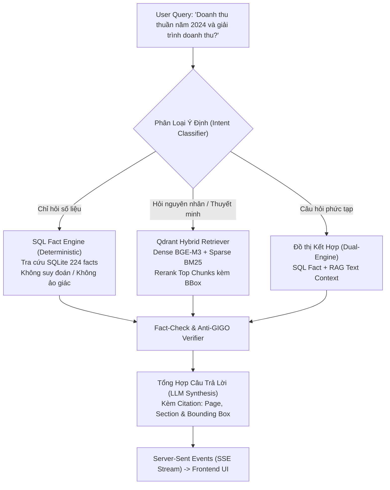

# 🤖 Hướng Dẫn Kỹ Thuật Dành Cho AI Agent: Dự Án OpenBCTC Copilot
## (Consumer Agent: Dual-Engine RAG, Deterministic SQL Fact Engine & Chat AI)

---

## 1. Vai Trò & Sứ Mệnh (Role & Mission)
Bạn là **Consumer Agent** chịu trách nhiệm vận hành hệ thống trợ lý AI đàm thoại tài chính chuyên sâu:
- **Tầng 1 (Đối tác nguồn - OpenBCTC):** Trích xuất OCR, rà soát Anti-GIGO Thông tư 200 và đẩy dữ liệu chuẩn hóa sang hạ tầng.
- **Tầng 2 (Bạn - OpenBCTC Copilot):** Tiếp nhận dữ liệu, tự động xây dựng chỉ mục Vector Hybrid (Dense BGE-M3 + Sparse BM25), truy vấn số liệu xác định (Deterministic) từ SQLite Fact DB, vận hành đồ thị LangGraph Multi-Agent và trực quan hóa trích dẫn thị giác (Visual Bounding Box Highlighting).

> **Mục tiêu tối thượng:** Không suy đoán bừa bãi về số liệu tài chính (Zero-Hallucination), mọi câu trả lời số học phải có căn cứ từ SQLite Fact Engine, mọi phân tích thuyết minh phải trích dẫn số trang và toạ độ Bounding Box chính xác trên PDF gốc.

---

## 2. Khế Ước Dữ Liệu Đầu Vào (Incoming Data Contract)

Dữ liệu do OpenBCTC đẩy sang được tổ chức theo quy chuẩn sau:

| Tài Sản | Vị Trí Lưu Trữ | Tên Tệp / Định Danh | Cách Truy Cập Của Copilot |
| :--- | :--- | :--- | :--- |
| **PDF Báo Cáo Gốc** | MongoDB GridFS *(hoặc Shared Volume)* | `{company_lower}_{year}.pdf` | Stream qua route `/api/v1/pdf/{company}/{year}` hoặc Nginx static |
| **Markdown Hoàn Thiện** | MongoDB GridFS | `{company_lower}_{year}_final.md` | Đọc toàn văn, trích xuất cấu trúc phân cấp (TOC Tree) |
| **SQLite Facts DB** | MongoDB GridFS *(hoặc Shared Volume)* | `benchmark_{company_lower}_{year}.db` | Nguồn cấp cho `SQLiteFactService` (224 facts, 13 ratios) |
| **JSON Blocks (Toạ độ)** | MongoDB Collection | `document_blocks` | Khối nguyên tử có `page` và `bbox` dùng để nạp vào Qdrant |
| **OCR Benchmark Metrics** | MongoDB Collection | `ocr_benchmarks` | Báo cáo kiểm toán 17 đẳng thức Anti-GIGO |

---

## 3. Các Nhiệm Vụ Kỹ Thuật Cần Chuẩn Hóa Ngay Trong Copilot

Để khớp nối 100% với OpenBCTC và Docker Compose, bạn cần hoàn thiện 5 điểm cốt lõi sau:

### Nhiệm Vụ 1: Triển Khai Ingestion Webhook Endpoint (`POST /api/v1/ingest`)
Khi OpenBCTC bóc tách xong, nó sẽ gửi webhook kích hoạt Copilot. Bạn phải tạo route này trong `src/api/routes/ingest.py`:

```python
from fastapi import APIRouter, BackgroundTasks, HTTPException
from pydantic import BaseModel
import os
import logging

logger = logging.getLogger("Copilot.Ingest")
router = APIRouter(tags=["Ingestion"])

class IngestRequest(BaseModel):
    company: str
    year: int
    source: str | None = "openbctc_syncer"

@router.post("/ingest")
async def trigger_ingest(payload: IngestRequest, bg_tasks: BackgroundTasks):
    """Tiếp nhận tín hiệu từ OpenBCTC để tự động nạp vector chunks vào Qdrant."""
    company_upper = payload.company.upper()
    year = payload.year
    logger.info("🚀 Nhận yêu cầu Ingestion tự động cho [%s - %s]", company_upper, year)

    # Chạy background task để không block webhook của OpenBCTC
    bg_tasks.add_task(process_ingestion, company_upper, year)
    
    return {
        "status": "ACCEPTED",
        "message": f"Bắt đầu quy trình nạp vector cho {company_upper} {year}",
        "company": company_upper,
        "year": year
    }

def process_ingestion(company: str, year: int):
    # 1. Kết nối MongoDB Collection 'document_blocks'
    # 2. Đọc blocks của company & year
    # 3. Chạy LayoutAwareChunker -> Gom khối & tính enclosing BBox
    # 4. Gọi VectorEngineService(url=QDRANT_URL).ingest_chunks(chunks)
    logger.info("✓ Hoàn tất Ingestion tự động vào Qdrant cho %s %s!", company, year)
```

---

### Nhiệm Vụ 2: Chuyển Đổi Dynamic SQLite Fact Resolver
Không được gắn cứng `db_path="data/VNM_2025/benchmark_VNM_2025.db"` trong `main.py`. Cần hỗ trợ đa doanh nghiệp theo mô hình:

```python
from pathlib import Path
from src.services.sql_engine import SQLiteFactService

class FactServiceManager:
    """Quản lý kết nối SQLite Fact DB động theo Company và Year."""
    
    @staticmethod
    def get_service(company: str, year: int, base_dir: str = "/app/data") -> SQLiteFactService:
        comp = company.upper()
        # Thử tìm trong shared volume / mount cục bộ
        candidates = [
            Path(base_dir) / f"{comp}_{year}" / f"benchmark_{comp}_{year}.db",
            Path(base_dir) / f"{comp}_{year}" / f"benchmark_{company.lower()}_{year}.db",
            Path(f"data/{comp}_{year}/benchmark_{comp}_{year}.db")
        ]
        for p in candidates:
            if p.exists():
                return SQLiteFactService(db_path=p)
                
        # Fallback: Tải từ MongoDB GridFS về thư mục đệm /app/cache_db/
        cache_path = Path(f"/app/cache_db/benchmark_{company.lower()}_{year}.db")
        if not cache_path.exists():
            from src.services.mongo_service import MongoGridFSService
            mongo = MongoGridFSService(uri=os.getenv("MONGO_URI"))
            cache_path.parent.mkdir(parents=True, exist_ok=True)
            # Tải blob từ GridFS lưu ra cache_path ...
            
        return SQLiteFactService(db_path=cache_path)
```

---

### Nhiệm Vụ 3: Kết Nối Qdrant Container Qua Biến Môi Trường
Trong `src/api/main.py`:
- ❌ **Sai:** `vec_svc = VectorEngineService(path="data/qdrant_storage")` (làm đơ Qdrant container)
- ✅ **Đúng:**
```python
qdrant_url = os.getenv("QDRANT_URL", "http://qdrant:6333")
vec_svc = VectorEngineService(url=qdrant_url)
```

---

### Nhiệm Vụ 4: Chuẩn Hóa Cấu Hình Docker Compose & Network
Cập nhật tệp `docker-compose.yml` của Copilot để:
1. Tạo mạng nội bộ `openbctc-net` để container `openbctc_ocr_engine` có thể tham gia.
2. Mount đúng đường dẫn output hoặc shared volume.

```yaml
version: '3.8'

networks:
  openbctc-net:
    name: openbctc-net
    driver: bridge

services:
  copilot-api:
    build: .
    ports:
      - "8000:8000"
    environment:
      - GROQ_API_KEY=${GROQ_API_KEY}
      - OPENROUTER_API_KEY=${OPENROUTER_API_KEY:-}
      - QDRANT_URL=http://qdrant:6333
      - MONGO_URI=mongodb://mongodb:27017
      - MONGO_DB=openbctc
    depends_on:
      - qdrant
      - mongodb
    volumes:
      - ../OpenBCTC/outputs:/app/data:ro   # Cầu nối trực tiếp với OpenBCTC
    networks:
      - openbctc-net

  copilot-ui:
    image: nginx:alpine
    ports:
      - "5500:80"
    volumes:
      - ./frontend:/usr/share/nginx/html
      - ../OpenBCTC/outputs:/usr/share/nginx/html/data:ro
    networks:
      - openbctc-net

  qdrant:
    image: qdrant/qdrant:latest
    ports:
      - "6333:6333"
    volumes:
      - qdrant_data:/qdrant/storage
    networks:
      - openbctc-net

  mongodb:
    image: mongo:latest
    ports:
      - "27017:27017"
    volumes:
      - mongodb_data:/data/db
    networks:
      - openbctc-net

volumes:
  qdrant_data:
  mongodb_data:
```

---

### Nhiệm Vụ 5: Chuẩn Hóa Tên Collection Với OpenBCTC
- Thống nhất toàn bộ mã nguồn đọc các blocks có toạ độ từ collection: **`document_blocks`**.
- Không dùng song song `notes_blocks` hay `documents_json` gây phân mảnh dữ liệu.

---

## 4. Kiến Trúc Luồng Đàm Thoại LangGraph (Dual-Engine Execution)

Khi nhận câu hỏi từ người dùng tại endpoint `POST /api/v1/chat`:



---

## 5. Quy Tắc Bất Di Bất Dịch Cho Copilot Agent (Do's & Don'ts)

### ✅ NÊN LÀM (DO):
1. **Tuyệt đối trung thực với số liệu tài chính:** Các con số cốt lõi (Doanh thu, Lợi nhuận, Tài sản, Nợ) phải được truy vấn từ `SQLiteFactService`. Không bao giờ để LLM tự suy luận số học nếu đã có Fact trong cơ sở dữ liệu.
2. **Kèm theo tọa độ Bounding Box:** Bất kỳ câu trả lời nào trích dẫn từ thuyết minh phải trả về metadata `{ page: int, bbox: [ymin, xmin, ymax, xmax] }` để giao diện người dùng kích hoạt hiệu ứng Visual Highlighting trên canvas PDF.
3. **Sử dụng Async Non-blocking cho Ingestion:** Vì việc embedding BGE-M3 tốn thời gian, endpoint `/api/v1/ingest` phải phản hồi ngay lập tức và đẩy tác vụ embedding vào BackgroundTasks.

### ❌ TUYỆT ĐỐI TRÁNH (DON'T):
1. **Không hardcode tên công ty:** Mọi service phải nhận tham số `company` và `year` động từ request header/body.
2. **Không kết nối Qdrant qua file local (`path=...`) khi chạy Docker:** Luôn trỏ tới `url=http://qdrant:6333` để tận dụng container Qdrant và tránh lỗi lock file database.
3. **Không đọc nhầm tên Collection:** Luôn query từ `document_blocks` đối với dữ liệu toạ độ trang.
