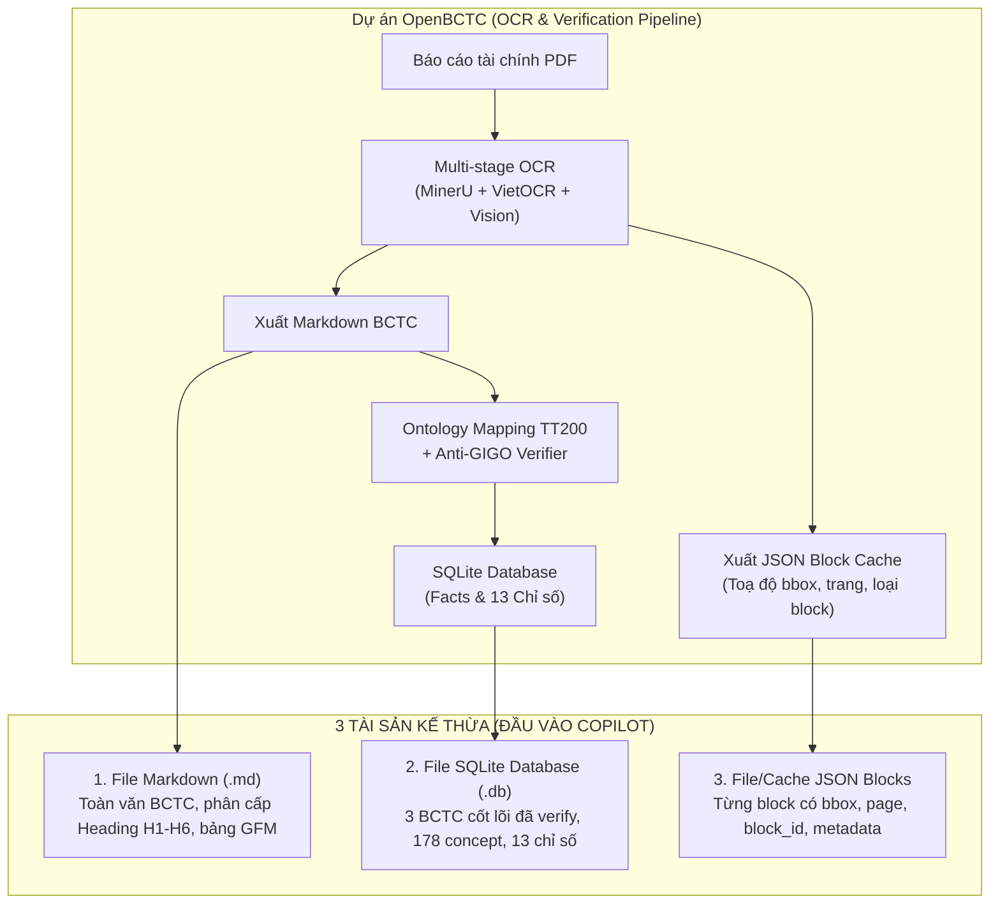
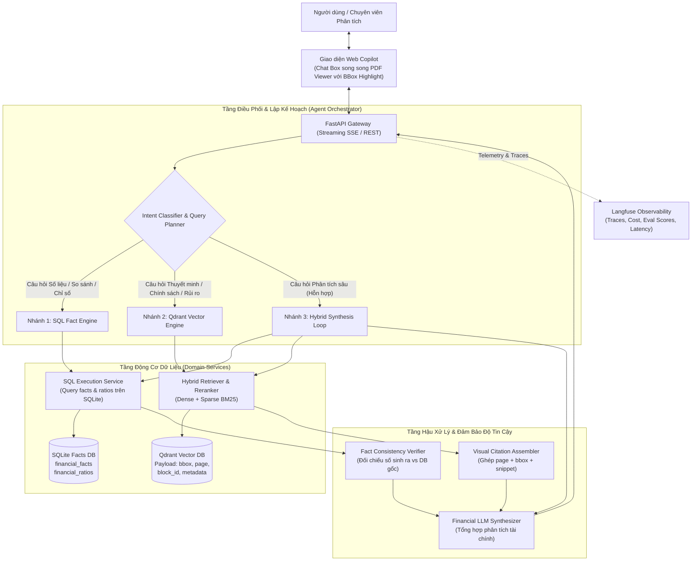

# 📊 OpenBCTC Copilot (Plan V2)
**Enterprise Financial Copilot & Dual-Engine RAG with Visual Grounding**

> **Định vị:** Trợ lý AI Phân tích Báo cáo Tài chính (BCTC) Doanh nghiệp chuyên sâu, kế thừa trực tiếp từ hệ thống bóc tách dữ liệu **OpenBCTC**.  
> **Cốt lõi:** Kết hợp sức mạnh của **Deterministic Symbolic AI (SQL Facts Engine)** và **Neural Semantic AI (Hybrid Qdrant RAG + Visual Grounding)** nhằm triệt tiêu hoàn toàn bài toán **ảo giác số liệu (Numeric Hallucination)** và cung cấp trích dẫn minh bạch tới từng toạ độ (Bounding Box) trên trang PDF gốc.

---

## 1. Khế Ước Kế Thừa Dữ Liệu Từ OpenBCTC (Input Contract)

Khác với các hệ thống RAG thông thường chỉ nhận file PDF hoặc text thô, **OpenBCTC Copilot** kế thừa trực tiếp 3 tầng dữ liệu tinh chế từ pipeline OCR & Post-processing của OpenBCTC:



### Chi tiết 3 nguồn dữ liệu đầu vào:

| Nguồn dữ liệu | Cấu trúc & Đặc điểm | Vai trò trong OpenBCTC Copilot | Cam kết chất lượng |
| :--- | :--- | :--- | :--- |
| **1. File SQLite Database** | Chứa 3 bảng chính: `financial_facts` (178 concepts TT200, mã số, số kỳ này, số kỳ trước), `financial_statements`, `financial_ratios` (13 chỉ số chuẩn). | **Deterministic Financial Engine (Text-to-SQL)**: Trả lời mọi câu hỏi về số liệu cốt lõi, so sánh kỳ, biến động tài chính, chỉ số ROE, ROA, Nợ/VCSH... | **0% Hallucination**: Số liệu đã qua kiểm toán 17 đẳng thức kế toán Anti-GIGO. |
| **2. File JSON Blocks** | Mảng các object block: `block_id`, `block_type`, `page`, `content`, `bbox: [ymin, xmin, ymax, xmax]`, `source`, `metadata: {company, year, is_note, engine}`. | **Semantic Retrieval & Visual Grounding**: Ingest vào Qdrant với đầy đủ metadata; làm căn cứ hiển thị khung highlight đỏ/xanh trực tiếp trên PDF Viewer. | **Minh bạch 100%**: Trích dẫn câu chữ kèm chính xác trang và toạ độ vùng ảnh. |
| **3. File Markdown (`.md`)** | Toàn văn BCTC dạng Markdown có cấu trúc Heading phân cấp, bảng biểu GFM, báo cáo ban kiểm toán, báo cáo ban giám đốc. | **Document Hierarchy & Parent-Child Context Expansion**: Lập cây mục lục (TOC Tree), mở rộng ngữ cảnh cha khi trích xuất block con, trả lời tổng quan vĩ mô. | **Toàn vẹn bối cảnh**: Không bị đứt gãy mạch ý kiến kiểm toán và giải trình chung. |

#### Ví dụ mẫu JSON Block kế thừa:
```json
{
  "block_id": "p12_mineru_txt_2",
  "block_type": "text",
  "page": 12,
  "content": "Các thuyết minh này là một bộ phận hợp thành và cần được đọc đồng thời với báo cáo tài chính riêng kèm theo...",
  "bbox": [0.142, 0.098, 0.915, 0.133],
  "source": "local_ocr",
  "metadata": {
    "company": "HPG",
    "year": 2025,
    "engine": "mineru_vietocr",
    "is_note": true
  }
}
```

---

## 2. Kiến Trúc Hệ Thống Tổng Thể (Dual-Engine Architecture)

Hệ thống được thiết kế theo triết lý **Lean AI Agent** (Thin Nodes, Fat Services) kết hợp cơ chế điều phối đa nhánh:



---

## 3. Tech Stack & Hạ Tầng

* **Ngôn ngữ & Runtime:** Python 3.11+, Pydantic v2
* **Data Framework & Vector DB:** 
  * Qdrant (Hybrid Search: Dense Vector + Sparse BM25 / BGE-M3)
  * SQLite3 (Lưu trữ Facts, Statements, Ratios có chỉ mục)
* **LLM & Embedding:**
  * LLM chính: OpenAI (GPT-4o / GPT-4o-mini) hoặc mô hình nội bộ vLLM
  * **Embedding Model (Dense):** `BAAI/bge-m3` qua `sentence-transformers` (1024 dims, đa ngữ tiếng Việt natively)
    * ⚠️ **Lý do không dùng fastembed cho dense:** fastembed không có `bge-m3` trong supported models — chỉ có English BGE. Phải dùng `sentence-transformers` + HuggingFace hub.
  * **Embedding Model (Sparse):** `Qdrant/bm25` qua `fastembed` (10 MB, không cần GPU)
  * Reranker Model: `BAAI/bge-reranker-base` qua `fastembed` (hoặc `bge-reranker-large` nếu đủ RAM)
  * > **Re-ingest bắt buộc** nếu đã có Qdrant collection cũ với `bge-small-en-v1.5` (384 dims) → cần `recreate=True` vì DENSE_DIM thay đổi từ 384 → 1024.
* **Agentic Framework:**
  * **LangGraph (Lean StateGraph):** Đóng vai trò Thin Orchestrator điều phối đồ thị trạng thái, quản lý vòng lặp phản tư kiểm toán (Fact-Consistency & Correction Loop), quản lý phiên hội thoại nhiều lượt (Multi-turn Checkpointer với `thread_id`), và thu thập toạ độ Bounding Box cho cơ chế Visual Grounding.
* **Observability & Evaluation:**
  * Langfuse v3 (Tracing toàn bộ cuộc hội thoại, Tool Calls, Token Usage, Latency)
  * Ragas (Faithfulness, Answer Relevance, Context Precision)
* **Backend API & Web Server:**
  * FastAPI, Uvicorn, SSE (Server-Sent Events) cho Streaming
* **Giao diện Người dùng (UI):**
  * Next.js / React hoặc Chainlit (Tích hợp PDF.js render bounding box highlight từ toạ độ `bbox`)
* **DevOps & Triển khai:**
  * Docker, Docker Compose, Caddy Reverse Proxy (Tự động cấp SSL/HTTPS), GitHub Actions (CI/CD)

---

## 4. Lộ Trình Triển Khai Chi Tiết (Roadmap & Execution Plan)

### Phase 1: Dual-Stream Ingestion Pipeline (Nạp & Lập Chỉ Mục Dữ Liệu)
*Mục tiêu: Đưa toàn bộ dữ liệu kế thừa vào trạng thái sẵn sàng truy vấn mà không làm mất thông tin không gian (bbox) hay tính chuẩn hoá số liệu.*

- [x] **1.1. Ingestion Adapter cho JSON Blocks vào Qdrant:**
  - Viết pipeline đọc các file JSON blocks từ OpenBCTC cache.
  - Chuẩn hoá payload mỗi point:
    ```python
    {
        "block_id": str,
        "content": str,
        "block_type": "text" | "table",
        "page": int,
        "bbox": list[float],          # [ymin, xmin, ymax, xmax]
        "company": str,
        "year": int,
        "is_note": bool,
        "source": str
    }
    ```
  - Tính toán dense embedding (`bge-m3`) và sparse vector (BM25 tokenization).
  - Đẩy vào Qdrant collection `financial_blocks` (có index payload theo `company`, `year`, `is_note`, `block_type`).
- [x] **1.2. Kết nối & Index SQLite Financial Database:**
  - Kết nối file SQLite tạo bởi OpenBCTC (`financial_facts`, `financial_statements`, `financial_ratios`).
  - Viết module DAO/Service tối ưu hóa truy vấn theo mã cổ phiếu (`company`), năm (`year`), kỳ báo cáo, và `canonical_concept` (178 concepts TT200).
- [x] **1.3. Hierarchical Markdown TOC Parser:**
  - Đọc file `.md` toàn văn để trích xuất cây phân cấp mục lục (Table of Contents: Heading $\rightarrow$ Page / Block Range).
  - Lưu Document Outline để phục vụ mở rộng ngữ cảnh cha (Parent Context Expansion) khi retriever tìm thấy một block con.

---

### Phase 2: Core Engines & Tool Registry (Động Cơ Truy Vấn Cốt Lõi)
*Mục tiêu: Xây dựng các công cụ độc lập (fat services) có thể test riêng rẽ bằng unit test.*

- [x] **2.1. Deterministic SQL Fact Engine (Tool 1):**
  - Cung cấp hàm truy vấn số học chính xác:
    - Tra cứu chỉ tiêu báo cáo: `get_fact(company, year, concept_or_code, period)`
    - Tra cứu chỉ số tài chính: `get_ratios(company, year)` (13 chỉ số: Thanh toán hiện hành, Nợ/VCSH, ROE, ROA, Biên lợi nhuận gộp...)
    - So sánh chuỗi thời gian: `compare_periods(company, concepts, years)`
  - Template hoá câu lệnh SQL, tuyệt đối không để LLM viết raw SQL tuỳ tiện trên môi trường tài chính (tránh SQL injection & tính sai logic).
- [x] **2.2. Semantic Hybrid Retriever & Reranker (Tool 2):**
  - Xây dựng Retriever kết hợp Dense Search + Sparse Search trên Qdrant.
  - Áp dụng bộ lọc Metadata Filter: tự động filter theo `company` và `year` từ ngữ cảnh câu hỏi.
  - Tích hợp `bge-reranker-large` để tái chấm điểm Top-K (từ Top-20 lấy Top-5 block liên quan nhất).
- [x] **2.3. Visual Citation & Grounding Formatter:**
  - Thiết kế chuẩn trả về cho Citation:
    ```json
    {
      "citation_id": "cite_1",
      "source_type": "note" | "statement",
      "block_id": "p12_mineru_txt_2",
      "page": 12,
      "bbox": [0.142, 0.098, 0.915, 0.133],
      "snippet": "Trích đoạn văn bản...",
      "confidence": 0.96
    }
    ```
  - Đảm bảo câu trả lời cuối cùng của LLM luôn gắn tag citation tương ứng (ví dụ: `[[cite_1]]`).

---

### Phase 3: Agentic Orchestrator & Reasoning Loop (LangGraph State Machine)
*Mục tiêu: Ghép nối các động cơ vào LangGraph StateGraph tinh gọn, xử lý được từ câu hỏi đơn giản đến bài toán phân tích phức tạp có vòng lặp kiểm toán.*

- [x] **3.1. Query Intent Classifier & Router (Thin Router):**
  - Phân loại câu hỏi thành 3 nhóm qua Pure Function:
    - `NUMERIC_FACT`: Hỏi số liệu đơn lẻ hoặc chỉ số $\rightarrow$ Chuyển thẳng sang SQL Tool.
    - `NOTE_EXPLANATION`: Hỏi chính sách, kiểm toán, cơ cấu chi tiết trong thuyết minh $\rightarrow$ Chuyển sang Qdrant Retriever.
    - `DEEP_ANALYSIS`: Hỏi nguyên nhân, tương quan biến động (ví dụ: *"Tại sao chi phí tài chính tăng và cơ cấu nợ vay biến động thế nào?"*) $\rightarrow$ Chuyển sang luồng Hybrid Reasoning.
- [x] **3.2. Hybrid Reasoning & Synthesis Node:**
  - Với câu hỏi hỗn hợp: Gọi SQL Tool lấy số liệu định lượng trước $\rightarrow$ Truy vấn Qdrant lấy phần giải trình thuyết minh tương ứng $\rightarrow$ Ghép vào System Prompt chuyên ngành kế toán để LLM tổng hợp phân tích.
- [x] **3.3. Fact-Consistency Verifier & Correction Loop (Anti-Hallucination):**
  - Quét lại câu trả lời do LLM sinh ra: Đối chiếu các con số xuất hiện trong bài với bảng số liệu thô từ SQL Fact Engine.
  - Sử dụng **Conditional Edge** trong LangGraph: Nếu phát hiện số bịa (không khớp với DB), tự động kích hoạt chu trình sửa sai (Reflection/Correction loop) để LLM sinh lại kèm cảnh báo.
- [x] **3.4. Citation Verifier Node (Visual Grounding Assembly):**
  - Kiểm tra tính hợp lệ của các `citation_id` gắn trong câu trả lời, khớp nối với danh sách toạ độ `bbox` và `page` để lưu vào `state["citations"]`.
- [x] **3.5. Tích hợp Langfuse Tracing & Checkpointing:**
  - Gắn `SqliteSaver` hoặc `MemorySaver` theo `thread_id` để quản lý multi-turn chat.
  - Gắn Langfuse callback handler cho toàn bộ luồng: Intent classification, SQL Tool invocation, Vector retrieval latency, LLM Generation tokens, Fact Verifier check.

---

### Phase 4: Observability, Evaluation & Hardening (Giám Sát & Đánh Giá)
*Mục tiêu: Định lượng độ chính xác của hệ thống bằng bộ chỉ số tiêu chuẩn trước khi đưa ra người dùng.*

- [x] **4.1. Xây dựng Golden Financial Dataset:**
  - Tập hợp 50 câu hỏi kiểm thử đại diện trên BCTC Vinamilk VNM 2025 (`data/golden_dataset.json`):
    - 20 câu hỏi số liệu cốt lõi (Kiểm tra độ chuẩn xác của SQL Tool - đối chiếu DB benchmark).
    - 20 câu hỏi Thuyết minh BCTC (Kiểm tra độ chính xác của Vector Retrieval & BBox citation).
    - 10 câu hỏi suy luận tổng hợp (Kiểm tra năng lực tổng hợp và phân tích nguyên nhân).
- [x] **4.2. Automated Evaluation Pipeline với Ragas & Langfuse:**
  - **SQL Execution Accuracy:** Đo lường độ sai lệch số liệu (<1% tolerance).
  - **Faithfulness (Ragas/Context-check):** Độ trung thực của câu trả lời so với ngữ cảnh SQL + Vector.
  - **Citation Precision:** Bounding box và số trang trích dẫn khớp tài liệu nguồn.
  - **Langfuse Telemetry:** Callback handler và client log score (`src/observability/langfuse_client.py`, `evaluator.py`, `benchmark_runner.py`).
- [x] **4.3. Human-in-the-Loop & Feedback Collector:**
  - Backend API: `POST /api/v1/feedback`, `GET /api/v1/feedback/stats`, ghi nhận audit log `logs/user_feedback.jsonl` và đồng bộ Langfuse trace score.
  - Giao diện Web: Cụm nút 👍 / 👎 trên từng tin nhắn AI kèm modal góp ý chuyên sâu (Sai số liệu, Sai trích dẫn, Thiếu chi tiết, Khác).

---

### Phase 5: Production Deployment & Interactive PDF UI (Triển Khai & Giao Diện)
*Mục tiêu: Đóng gói toàn bộ hệ thống vào container, sẵn sàng vận hành trên máy chủ VPS/Cloud.*

- [ ] **5.1. FastAPI Production Gateway:**
  - Endpoint `/api/v1/chat`: Streaming SSE phản hồi từng token kèm metadata citation và thread_id.
  - Endpoint `/api/v1/pdf/bbox`: Phục vụ xem tọa độ highlight.
  - Endpoint `/healthz`, `/readyz`: Kiểm tra trạng thái Qdrant, SQLite, LLM API.
- [ ] **5.2. Web UI Hỗ Trợ Visual Grounding (PDF Split Screen):**
  - Màn hình chia đôi (Split-screen):
    - Cửa sổ trái: Khung hội thoại AI với Markdown, bảng biểu tài chính, các thẻ trích dẫn nguồn.
    - Cửa sổ phải: Trình đọc PDF (PDF.js). Khi người dùng bấm vào một trích dẫn (ví dụ: `[[cite_1]]` - Thuyết minh 12, Trang 24), PDF tự động lật đến trang 24 và vẽ khung chữ nhật bao quanh toạ độ `bbox` tương ứng.
- [ ] **5.3. Containerization & Orchestration (Full Docker Stack):**
  - `Dockerfile`: Multi-stage build (tối ưu hóa kích thước, non-root user, cài dependency bằng `uv`).
  - `docker-compose.yml`:
    - Service `copilot-api`: FastAPI backend.
    - Service `copilot-ui`: Web frontend (phục vụ qua Nginx tĩnh).
    - Service `qdrant`: Vector database (Lưu trữ Embedding).
    - Service `minio`: Object Storage (Lưu trữ PDF gốc, Markdown, JSON).
    - Service `postgres`: Relational Database (SQL Engine cho dữ liệu tài chính dạng bảng).
- [ ] **5.4. CI/CD & Automated Evaluation Gate:**
  - GitHub Actions chạy `ruff` + `pytest`.
  - Chạy Evaluation Gate trên Golden Dataset: Nếu Faithfulness < 0.90 hoặc SQL Accuracy < 0.98 $\rightarrow$ Chặn merge PR.
  - Tự động build và push container image lên GHCR.

---

## 5. Cấu Trúc Mã Nguồn Chuẩn (Lean LangGraph Structure)

Áp dụng hướng dẫn kiến trúc tinh gọn, cấu trúc thư mục của **OpenBCTC Copilot** được phân tách rõ ràng giữa Tầng Điều phối (Agent) và Tầng Dịch vụ Nghiệp vụ (Services):

```text
OpenBCTC Copilot/
├── app/
│   ├── main.py                     # FastAPI entrypoint & router mounts
│   ├── config.py                   # Pydantic Settings (.env)
│   └── api/
│       ├── v1/
│       │   ├── chat.py             # Chat streaming SSE endpoint
│       │   ├── documents.py        # Quản lý danh sách BCTC & PDF
│       │   └── health.py           # Health checks (/healthz, /readyz)
│
├── src/
│   ├── agents/                     # TẦNG ĐIỀU PHỐI (ORCHESTRATION - THIN LANGGRAPH)
│   │   ├── copilot/
│   │   │   ├── state.py            # CopilotState (query, plan, facts, citations, answer)
│   │   │   ├── routers.py          # Intent Classifier (Pure decision functions)
│   │   │   ├── graph.py            # Khai báo & Compile StateGraph (< 80 dòng)
│   │   │   ├── agent.py            # CopilotAgent facade (invoke, astream)
│   │   │   └── nodes/              # Các adapter node độc lập (< 50 dòng/node)
│   │   │       ├── route_query.py
│   │   │       ├── execute_sql.py
│   │   │       ├── retrieve_notes.py
│   │   │       ├── verify_citations.py # Visual Grounding Citation Assembler
│   │   │       ├── verify_facts.py     # Anti-Hallucination Consistency Checker
│   │   │       └── synthesize.py
│   │
│   ├── services/                   # TẦNG DỊCH VỤ NGHIỆP VỤ (FAT SERVICES)
│   │   ├── sql_engine.py           # Thao tác với SQLite financial_facts & ratios
│   │   ├── vector_engine.py        # Qdrant Hybrid Search (Dense + Sparse) & Rerank
│   │   ├── citation_engine.py      # BBox mapper & Visual grounding helper
│   │   └── toc_catalog.py          # Markdown Heading Tree & Parent context expander
│   │
│   ├── models/                     # DATA MODELS (Pydantic DTOs)
│   │   ├── block.py                # JSON Block schema (block_id, bbox, page, metadata)
│   │   ├── citation.py             # CitationWithBBox schema
│   │   └── financial.py            # Fact, Statement, Ratio DTOs
│   │
│   └── observability/
│       └── langfuse_client.py      # Telemetry, callbacks & custom trace spans
│
├── ingestion/                      # PIPELINE NẠP DỮ LIỆU
│   ├── run_ingest.py               # CLI: Ingest JSON blocks & Markdown vào Qdrant/Catalog
│   └── parsers/
│       ├── json_block_loader.py    # Đọc cache JSON từ OpenBCTC
│       └── md_hierarchy_parser.py  # Đọc file .md trích xuất TOC
│
├── eval/                           # EVALUATION & BENCHMARK
│   ├── golden_set.jsonl            # 50 câu hỏi chuẩn chuyên gia kế toán
│   └── run_eval.py                 # Script chạy benchmark Ragas & SQL Accuracy
│
├── ui/                             # WEB FRONTEND
│   ├── components/
│   │   ├── ChatWindow.tsx          # Khung chat & markdown table
│   │   └── PDFViewerWithBBox.tsx   # Trình xem PDF có vẽ bounding box highlight
│   └── package.json
│
├── docker/
│   ├── Dockerfile
│   └── Caddyfile
├── docker-compose.yml              # Môi trường Development
├── docker-compose.prod.yml         # Môi trường Production
└── pyproject.toml
```

---

## 6. So Sánh Bước Đột Phá: Plan V1 vs Plan V2

| Tiêu chí | Plan V1 (Cũ) | Plan V2 (Mới - Tái Thiết Kế) |
| :--- | :--- | :--- |
| **Nguồn dữ liệu sử dụng** | Chỉ parse file Markdown thô bằng `MarkdownNodeParser`. | **Sử dụng trọn vẹn 3 tài sản OpenBCTC**: SQLite DB + JSON Blocks (BBox) + Markdown. |
| **Độ chuẩn xác số liệu** | Dễ ảo giác do LLM đọc bảng số Markdown và tự tính nhẩm. | **100% chuẩn xác (Zero Hallucination)**: Số cốt lõi lấy từ SQLite Facts đã verify 17 đẳng thức kế toán. |
| **Trích dẫn nguồn (Citations)** | Chỉ trích dẫn tên tài liệu hoặc số trang ước lượng. | **Visual Grounding**: Trích dẫn chính xác số trang `page` và toạ độ `bbox`, cho phép vẽ khung highlight trên PDF. |
| **Cơ chế tìm kiếm** | Vector Search thông thường trên text chunks. | **Dual-Engine**: SQL Fact Engine cho số liệu + Hybrid Qdrant Search (Dense + Sparse BM25 + Reranker) cho Thuyết minh. |
| **Khả năng phân tích sâu** | Bị giới hạn trong độ dài ngữ cảnh vector retriever. | **Multi-step Reasoning**: Kết hợp số liệu biến động từ SQL + lời giải trình chi tiết từ Thuyết minh Qdrant. |
| **Kiến trúc Code & Agent** | Script phân mảnh, chưa phân định tầng điều phối. | **Lean LangGraph Architecture**: Thin Nodes, Fat Services, kiểm toán phản tư lặp, kiểm thử độc lập từng module. |

---

## 7. Các Bước Triển Khai Kế Tiếp Ngay Bây Giờ (Immediate Next Steps)

1. **Khởi tạo Data Models (`src/models/`):**
   - Viết Pydantic models cho `JSONBlock`, `BBox`, `CitationWithBBox`, `FinancialFactQuery`.
2. **Xây dựng Ingestion Pipeline (`ingestion/`):**
   - Viết `json_block_loader.py` nạp các block JSON mẫu (như `HPG_2025/page_12.json`) vào Qdrant kèm vector `bge-m3`.
3. **Xây dựng SQL Service (`src/services/sql_engine.py`):**
   - Viết các hàm query facts và 13 chỉ số tài chính từ SQLite DB do OpenBCTC cung cấp.
4. **Xây dựng LangGraph State & Copilot Graph (`src/agents/copilot/`):**
   - Thiết lập StateGraph điều phối với các nodes: SQL execution, Notes retrieval, Citation verification, và Fact checking.
5. **Xây dựng Endpoint Chat Prototype (`app/api/v1/chat.py`):**
   - Phát luồng Streaming SSE trả về text kèm danh sách citations chứa `bbox`.
