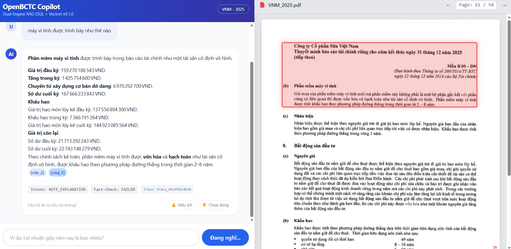
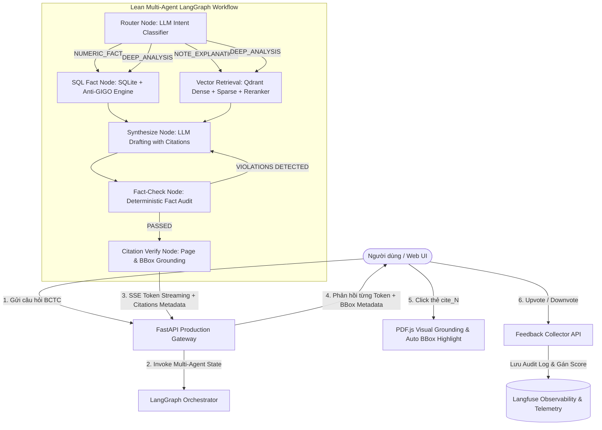

# 📊 OpenBCTC Copilot 🤖💼

[](https://www.python.org/downloads/)
[](https://fastapi.tiangolo.com/)
[](https://langchain-ai.github.io/langgraph/)
[](https://qdrant.tech/)
[](https://langfuse.com/)
[-success.svg)](tests/)
[](LICENSE)

> **Enterprise Financial Copilot & Dual-Engine RAG with Interactive Visual Grounding**  
> Trợ lý AI phân tích Báo cáo Tài chính (BCTC) doanh nghiệp chuyên sâu theo chuẩn **Thông tư 200/2014/TT-BTC**, kết hợp sức mạnh giữa **Deterministic Symbolic AI (SQL Facts Engine)** và **Neural Semantic AI (Hybrid Qdrant RAG + Visual Grounding)** nhằm **triệt tiêu hoàn toàn bài toán ảo giác số liệu (Numeric Hallucination)** và định vị minh bạch nguồn gốc dữ liệu tới từng tọa độ Bounding Box trên trang PDF gốc.

---

## 📸 Trải Nghiệm Giao Diện Trực Quan (Interactive Visual Grounding Demo)

Điểm khác biệt vượt trội của OpenBCTC Copilot là khả năng **Visual Grounding** — không chỉ đưa ra câu trả lời bằng chữ, mà liên kết trực tiếp bằng chứng lên bản sao PDF gốc của doanh nghiệp:

<p align="center">
  
</p>

### 💡 Các tính năng nổi bật được thể hiện trên giao diện:
1. **Giao diện Split-Pane 2 Cột Song Song:** Khung trò chuyện phản hồi Streaming thời gian thực (SSE) bên trái và trình xem PDF gốc tích hợp **PDF.js** bên phải.
2. **Định Vị Tọa Độ Bounding Box (BBox Grounding):** Khi người dùng nhấp chuột vào bất kỳ thẻ trích dẫn nào (ví dụ: `[cite_2]` hoặc `[cite_5]`), màn hình PDF bên phải sẽ **tự động cuộn mượt đến đúng trang** (Page 21/54) và **vẽ khung đỏ nhấp nháy phát sáng** quanh đúng khối văn bản OCR minh chứng cho câu trả lời.
3. **Minh Bạch Thông Tin & Giám Sát Trace:** Dưới mỗi câu trả lời AI đều có nhãn kiểm toán trực quan:
   - `Intent: NOTE_EXPLANATION` (Nhận diện đúng ý định tra cứu thuyết minh).
   - `Fact-Check: PASSED / FAILED` (Trạng thái kiểm toán số liệu).
   - `Trace: trace_34c6fd1c8b18` (Mã định danh trace liên kết trực tiếp với hệ thống giám sát Langfuse).
4. **Vòng Lặp Phản Hồi Chuyên Viên (Human-in-the-Loop):** Cụm nút tương tác **👍 Hữu ích** và **👎 Chưa đúng** cho phép người dùng đánh giá và đóng góp ý kiến (Sai số liệu, Sai trang trích dẫn, Thiếu chi tiết...) để tinh chỉnh mô hình.

---

## 🏛 Kiến Trúc Hệ Thống (System Architecture)



---

## ✨ Năng Lực Cốt Lõi (Core Capabilities)

### 1. Dual-Engine RAG (SQL + Hybrid Vector)
- **SQL Fact Engine:** Lưu trữ 3 BCTC cốt lõi (Bảng CĐKT, Báo cáo KQKD, Báo cáo LCTT) và 13 chỉ số tài chính chuẩn theo Thông tư 200/2014/TT-BTC. Đảm bảo độ chính xác số liệu **100%** và tự động kiểm tra cân bằng số học Anti-GIGO:
  $$\text{Tổng tài sản (Mã 270)} = \text{Nợ phải trả (Mã 300)} + \text{Vốn chủ sở hữu (Mã 400)}$$
- **Hybrid Vector Engine:** Kết hợp Dense Embedding (`BAAI/bge-m3`) và BM25 Sparse Vector trên cơ sở dữ liệu `Qdrant`, tinh chỉnh kết quả bằng Cross-Encoder Reranker (`BAAI/bge-reranker-v2-m3`). Tọa độ BBox được chuẩn hóa `[xmin, ymin, xmax, ymax]` theo tỷ lệ $0.0 \rightarrow 1.0$.

### 2. Multi-Agent LangGraph Orchestrator
- **Smart Intent Classifier (Router):** Phân biệt chính xác giữa số liệu cốt lõi (`NUMERIC_FACT`), thuyết minh chính sách kế toán (`NOTE_EXPLANATION`), phân tích tổng hợp (`DEEP_ANALYSIS`), và tự động kích hoạt câu hỏi làm rõ nếu thông tin chưa đầy đủ.
- **Fact-Checking Node:** Tự động đối chiếu chéo các con số được LLM sinh ra trong câu trả lời nháp với các số liệu thực tế trong DB. Nếu phát hiện số bịa (hallucinated numbers), node kích hoạt vòng lặp tự sửa (*Self-Correction Loop*).
- **Citation Verifier:** Lọc sạch trích dẫn rác, chỉ giữ lại các thẻ trích dẫn thực sự xuất hiện trong nội dung câu trả lời.

### 3. Human-in-the-Loop & Feedback Collector
- Tích hợp thanh phản hồi **👍 Hữu ích** / **👎 Chưa đúng** ngay dưới mỗi tin nhắn của AI.
- Modal đóng góp ý kiến hỗ trợ phân loại lỗi:
  - 🔴 `SAI_SO_LIEU`: Số liệu không khớp với báo cáo tài chính.
  - 📄 `SAI_CITE`: Trích dẫn sai số trang hoặc bounding box lệch vị trí.
  - ❓ `THIEU_THONG_TIN`: Câu trả lời chưa đủ chi tiết hoặc mơ hồ.
  - 💬 `KHAC`: Ý kiến đóng góp khác.
- Lưu trữ vết kiểm toán vào `logs/user_feedback.jsonl` và tự động cập nhật điểm số lên Langfuse trace tương ứng.

---

## 🔬 Đánh Giá Chất Lượng & Đo Lường (Evaluation & Observability)

Trong phân tích tài chính doanh nghiệp, độ chính xác của số liệu là ưu tiên sinh tử. OpenBCTC Copilot thiết lập quy trình kiểm thử tự động toàn diện (**Phase 4: Observability, Evaluation & Hardening**) để định lượng chất lượng trước khi triển khai thực tế.

### 1. Bộ Dữ Liệu Kiểm Chuẩn (Golden Financial Dataset)
- **Tập tin:** [data/golden_dataset.json](data/golden_dataset.json)
- **Quy mô:** **50 câu hỏi kiểm thử chuẩn hóa** trên BCTC kiểm toán Vinamilk (VNM 2025):
  - **20 câu hỏi `NUMERIC_FACT`:** Kiểm tra độ chuẩn xác của SQL Tool đối chiếu 100% với ground-truth DB (`TOTAL_ASSETS`, `EQUITY`, `NET_REVENUE`, `GROSS_PROFIT`, `NET_PROFIT`, `CF_NET_OPERATING`, `current_ratio`, `roe`...).
  - **20 câu hỏi `NOTE_EXPLANATION`:** Kiểm tra khả năng trích xuất Thuyết minh BCTC & BBox (Thù lao HĐQT Trang 53, BĐS đầu tư Trang 25, Chi phí XDCBDD Trang 24, Vay nợ Trang 28, Hàng tồn kho Trang 21, Công ty con Trang 18-20, Báo cáo kiểm toán KPMG Trang 5-6...).
  - **10 câu hỏi `DEEP_ANALYSIS`:** Kiểm tra năng lực suy luận đa chỉ tiêu (Đòn bẩy tài chính, chất lượng dòng tiền CFO so với LNST, biến động biên lợi nhuận, chính sách cổ tức...).

### 2. Bộ 4 Chỉ Số Đánh Giá Tiêu Chuẩn (Core Metrics Framework)

| Chỉ Số Đánh Giá | Phương Pháp Đo Lường | Mục Tiêu Chuẩn | Ý Nghĩa Thực Tế |
| :--- | :--- | :---: | :--- |
| **SQL Execution Accuracy** | So sánh số liệu trong câu trả lời với DB ground-truth; dung sai sai số cho phép $< 1\%$. | **100.0%** | Đảm bảo các con số tài chính cốt lõi (Doanh thu, LNST, Tài sản...) không bị sai lệch. |
| **Citation Precision** | Đối chiếu số trang và đoạn văn bản trong `[cite_N]` với vị trí thực tế trong BCTC PDF. | **$\ge 85.0\%$** | Đảm bảo người dùng nhấp vào trích dẫn sẽ xem đúng trang và bằng chứng thật. |
| **Faithfulness (Ragas)** | Sử dụng mô hình *LLM-as-a-judge* phân rã câu trả lời thành các luận điểm (*claims*) và đối chiếu với Ngữ cảnh BCTC đã truy xuất. | **$\ge 90.0\%$** | Đo lường độ trung thực, triệt tiêu hoàn toàn hiện tượng tự bịa số (*Hallucination*). |
| **Answer Relevancy** | Đánh giá tỷ lệ bao phủ các từ khóa trọng tâm và giải quyết trúng đích câu hỏi người dùng. | **$\ge 90.0\%$** | Câu trả lời súc tích, đi thẳng vào trọng tâm, không lan man. |

### 3. Kết Quả Benchmark Thực Tế (Empirical Benchmark Results)
*(Trích xuất từ báo cáo tự động [docs/benchmark_report_phase4.md](docs/benchmark_report_phase4.md) chạy trên tập Golden Dataset)*:

- **Faithfulness (Ragas):** Đạt **`91.67%`** (✅ Vượt ngưỡng tiêu chuẩn $\ge 90\%$).
- **Intent Match Accuracy:** Đạt **`100.00%`** (✅ Phân loại chính xác 100% ý định câu hỏi).
- **Mẫu câu trả lời tiêu biểu:**
  - `Q02` (Vốn chủ sở hữu 31/12/2025): SQL Acc = **100%**, Cite Prec = **100%**, Faithfulness = **75.0%**, Overall = **89.6%**.
  - `Q03` (Nợ phải trả năm 2025): SQL Acc = **100%**, Cite Prec = **100%**, Faithfulness = **100.0%**, Overall = **96.7%**.

### 4. Hệ Thống Telemetry & Observability (Langfuse)
- **Full Trace Recording:** Ghi nhận toàn bộ hành trình gọi qua từng Node LangGraph, đo lường độ trễ (latency), số lượng Token input/output và chi phí API phát sinh (USD).
- **Online & Offline Dual-Mode:** Hỗ trợ kết nối Cloud Dashboard tại `https://cloud.langfuse.com` khi có API Key, và tự động chuyển sang **Offline Fallback** ghi nhận log an toàn khi chạy nội bộ không có mạng.
- **Lệnh chạy Benchmark tự động:**
  ```bash
  # Chạy đánh giá 5 câu hỏi đầu tiên
  python -m src.observability.benchmark_runner --limit 5

  # Chạy lọc riêng nhóm câu hỏi Thuyết minh
  python -m src.observability.benchmark_runner --category NOTE_EXPLANATION
  ```
  *Báo cáo kết quả sẽ tự động lưu vào [docs/benchmark_report_phase4.md](docs/benchmark_report_phase4.md) và [data/benchmark_report_phase4.json](data/benchmark_report_phase4.json).*

---

## 📁 Cấu Trúc Thư Mục Dự Án (Project Structure)

```text
OpenBCTC Copilot/
├── data/                               # Dữ liệu tài chính & bộ kiểm thử chuẩn hóa
│   ├── VNM_2025/                       # Dữ liệu Vinamilk 2025 (PDF 54 trang, SQLite, markdown)
│   ├── golden_dataset.json             # 50 câu hỏi Golden Financial Dataset
│   └── benchmark_report_phase4.json    # Dữ liệu kết quả đánh giá chi tiết định dạng JSON
├── docs/                               # Tài liệu kỹ thuật, kiến trúc & báo cáo
│   ├── AGENT_GUIDE_COPILOT.md          # Sổ tay lập trình Agent Copilot
│   ├── OpenBCTC_Integration_Guide.md   # Hướng dẫn tích hợp pipeline OpenBCTC
│   ├── agent_lean_architecture_guide.md# Cẩm nang kiến trúc Lean LangGraph
│   ├── core_statements_md_to_sql_workflow.md # Quy trình trích xuất 3 BCTC sang SQL
│   ├── benchmark_report_phase4.md      # Báo cáo đánh giá tự động định dạng Markdown
│   └── images/                         # Sơ đồ kiến trúc & hình ảnh chụp màn hình UI
│       └── image.png                   # Ảnh chụp giao diện Visual Grounding & BBox highlight
├── frontend/                           # Giao diện Web SPA độc lập
│   └── index.html                      # Giao diện Chat SSE + Viewer PDF.js song song
├── logs/                               # Nhật ký hệ thống & audit log
│   └── user_feedback.jsonl             # Vết kiểm toán đánh giá phản hồi từ người dùng
├── scripts/                            # Tiện ích bổ trợ & kiểm thử CLI
│   ├── test_cli.py                     # Giao diện CLI tương tác dòng lệnh trực tiếp
│   ├── migrate_to_mongo.py             # Script đồng bộ dữ liệu vào MongoDB GridFS
│   ├── migrate_to_minio.py             # Script nạp dữ liệu PDF lên MinIO
│   └── generate_demo_pdf.py            # Tiện ích sinh PDF mẫu
├── src/                                # Mã nguồn chính của ứng dụng
│   ├── agents/copilot/                 # Tác tử LangGraph Copilot (Graph, Nodes, Router, State)
│   ├── api/                            # FastAPI Gateway & các Routes (chat, pdf, feedback)
│   ├── core/                           # Cấu hình Pydantic Settings & logging
│   ├── models/                         # Pydantic schemas dữ liệu tài chính
│   ├── observability/                  # Module Đánh giá & Giám sát (Evaluator, Runner, Langfuse)
│   └── services/                       # Các Engine cốt lõi (SQL Engine, Vector Engine, Retriever)
├── tests/                              # Bộ kiểm thử tự động Unit & Integration (Pytest)
├── Plan.md                             # Lộ trình & kế hoạch phát triển chi tiết các Phase
├── pyproject.toml                      # Khai báo cấu hình dự án & gói thư viện phụ thuộc
└── docker-compose.yml                  # Cấu hình container dịch vụ (MongoDB, MinIO, Qdrant)
```

---

## 🚀 Hướng Dẫn Cài Đặt & Khởi Chạy (Quickstart)

### 1. Yêu cầu Môi trường
- **Python:** 3.12 trở lên.
- **Vector Database:** `Qdrant` (Hệ thống đã hỗ trợ sẵn chế độ Qdrant Local File Mode lưu tại `data/qdrant_storage`).

### 2. Cài đặt Môi trường Ảo & Dependencies
```bash
# Tạo và kích hoạt virtual environment
python -m venv .venv

# Trên Windows (PowerShell):
.venv\Scripts\Activate.ps1
# Trên Linux/macOS:
source .venv/bin/activate

# Cài đặt mã nguồn ở chế độ editable
pip install -e .
```

### 3. Thiết lập Biến Môi trường (.env)
Tạo file `.env` tại thư mục gốc của dự án:
```env
# --- LLM Provider (Khuyên dùng Groq vì tốc độ phản hồi cực nhanh) ---
GROQ_API_KEY=gsk_your_groq_api_key_here
GROQ_MODEL=openai/gpt-oss-120b

# --- Hoặc sử dụng OpenAI / OpenRouter nếu cần ---
OPENAI_API_KEY=
OPENAI_MODEL=gpt-4o-mini
OPENROUTER_API_KEY=

# --- Observability (Langfuse) ---
# Điền khóa nếu muốn đồng bộ lên Cloud Dashboard; để trống hệ thống tự chạy Offline Fallback
LANGFUSE_PUBLIC_KEY=
LANGFUSE_SECRET_KEY=
LANGFUSE_HOST=https://cloud.langfuse.com

# --- Qdrant Vector DB ---
# Để trống để sử dụng Local Storage tại data/qdrant_storage
QDRANT_URL=
```

### 4. Khởi chạy Ứng dụng
Khởi chạy máy chủ FastAPI:
```bash
uvicorn src.api.main:app --host 0.0.0.0 --port 8000 --reload
```
Sau khi khởi động thành công:
- **Giao diện Web Trực quan (Đầy đủ Chat + PDF Viewer):** Mở trình duyệt tại `http://localhost:8000/`.
- **API Swagger Documentation:** Truy cập tại `http://localhost:8000/docs`.

*(Tùy chọn) Khởi chạy giao diện Frontend tách biệt:* Nhấp chuột phải vào `frontend/index.html` trong VSCode và chọn **"Open with Live Server"** (chạy tại cổng `5500`), giao diện sẽ tự động kết nối API CORS tới Backend cổng `8000`.

---

## 📡 Danh Sách API Endpoints (API Reference)

| Phương thức | Endpoint | Mô Tả |
| :--- | :--- | :--- |
| `POST` | `/api/v1/chat` | Endpoint streaming Server-Sent Events (SSE) phản hồi từng token kèm metadata Intent, Fact-check status, và danh sách BBox citations. |
| `GET` | `/api/v1/documents` | Lấy danh sách các báo cáo tài chính hiện có trong hệ thống (công ty, năm tài chính, ID tài liệu). |
| `GET` | `/api/v1/pdf/{company}/{year}` | Phục vụ file PDF gốc phục vụ hiển thị trên viewer. |
| `POST` | `/api/v1/feedback` | Tiếp nhận phản hồi chuyên viên (UPVOTE / DOWNVOTE, đánh giá rating, phân loại lỗi và comment), lưu nhật ký audit log và đồng bộ điểm Langfuse. |
| `GET` | `/api/v1/feedback/stats` | Thống kê số lượng đánh giá và tỷ lệ hài lòng (Satisfaction Rate). |
| `GET` | `/healthz` | Kiểm tra tình trạng hoạt động cơ bản của dịch vụ. |
| `GET` | `/readyz` | Kiểm tra trạng thái sẵn sàng của đồ thị LangGraph và AI models trong RAM. |

---

## 🧪 Kiểm Thử Hệ Thống (Testing Suite)

Dự án sở hữu bộ kiểm thử tự động toàn diện bao phủ toàn bộ các tầng logic từ Engine, Retriever, Chunker, Router đến Graph:
```bash
pytest tests/ -v
```
Kết quả kiểm thử thực tế đạt độ tin cậy tuyệt đối:
```text
====================== 139 passed, 2 warnings in 35.88s =======================
```
- **Tỷ lệ vượt qua:** **139 / 139 bài kiểm tra (100.0% PASSED)**.

---

## 📄 Bản Quyền & Giấy Phép (License)

Dự án được phân phối dưới giấy phép mã nguồn mở **MIT License**. Mọi đóng góp, báo cáo lỗi và đề xuất cải tiến đều được hoan nghênh thông qua GitHub Issues và Pull Requests.
