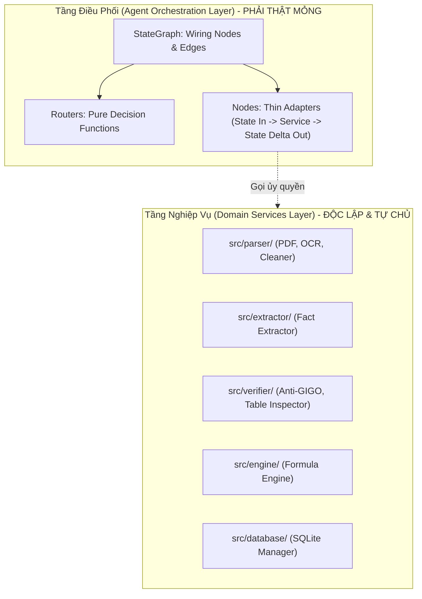
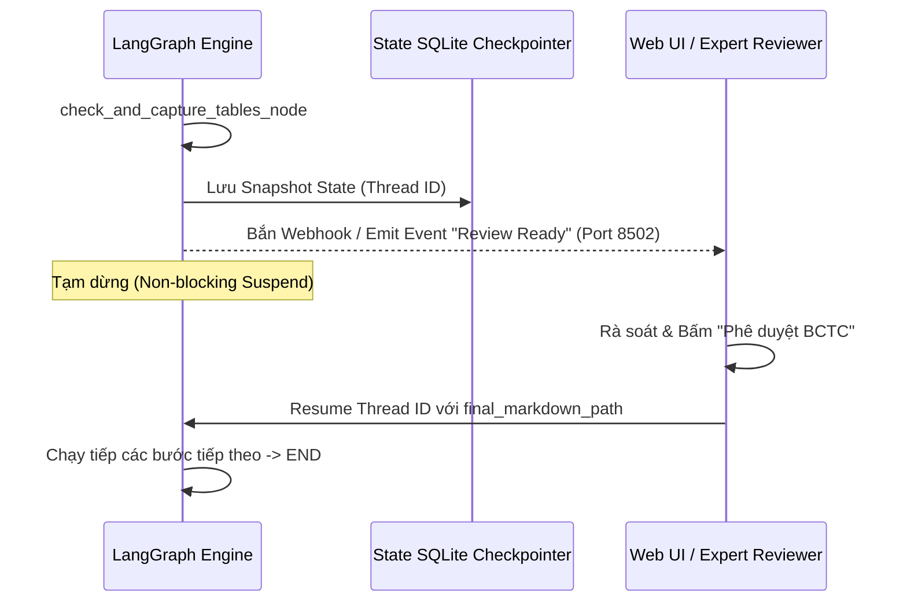

# Hướng Dẫn Thiết Kế & Cấu Trúc Mã Nguồn Tinh Gọn (Lean Code) Cho AI Agent

> **Dự án:** FinAudit AI (OpenBCTC)  
> **Áp dụng cho:** Hệ thống Multi-Agent, LangGraph Workflows, Document Ingestion, Financial Copilot  
> **Mục tiêu:** Tối giản nhận thức (Low Cognitive Load), Kiến trúc phân tách rõ ràng (Separation of Concerns), Dễ bảo trì & Mở rộng quy mô, Kiểm thử độc lập (Testability)  

---

## 1. Đặt Vấn Đề & Phân Tích Hiện Trạng Codebase

### 1.1. Bối cảnh Hệ thống FinAudit AI
FinAudit AI là hệ thống phân tích Báo cáo Tài chính (BCTC) phức tạp, kết hợp giữa:
- **Triage & Ingestion:** Phân loại tài liệu (Native vs Scanned), trinh sát mục lục (TOC), điều phối đa nhánh.
- **Hybrid Extraction:** Vision LLM (Gemini/Groq) cho 6 trang BCTC cốt lõi + Local OCR (Paddle/VietOCR/RapidOCR) cho Thuyết minh.
- **Deterministic Verification:** Tầng kiểm toán số học Anti-GIGO (Thông tư 200) + 13 chỉ số tài chính bằng Python thuần.
- **RAG & Table Inspection:** Cắt ảnh bảng biểu 200 DPI, Parent-Child RAG Catalog, Human-in-the-Loop Review.

Để vận hành quy trình này, dự án sử dụng **LangGraph** để xây dựng đồ thị trạng thái (StateGraph).

---

### 1.2. Phân Tích "Code Smells" Hiện Tại ở `src/agents/ingestion_graph.py`
Tệp [`src/agents/ingestion_graph.py`](../src/agents/ingestion_graph.py) hiện có hơn **730 dòng mã** và đang bộc lộ những anti-pattern điển hình khi viết code cho Agent:

```text
[Vấn đề 1: God File]
Một file duy nhất chứa: Định nghĩa 8 Nodes + 2 Routers + Graph Compilation + Agent Class 
+ Khởi tạo 11 Sub-services + Gọi Web Server chạy cục bộ.

[Vấn đề 2: Fat Nodes (Node quá nặng)]
Mỗi hàm Node (như extract_core_statements_node) dài 150+ dòng:
├── Vừa mở pdfplumber quét từng trang
├── Vừa gọi VisionOCRPipeline
├── Vừa chuẩn hóa Normalizer & Phân loại Classifier
├── Vừa trích xuất Facts và ghi DB SQLite
├── Vừa kích hoạt VisionZoomCorrector lặp sửa lỗi
└── Vừa tính toán 13 chỉ số tài chính FormulaEngine!

[Vấn đề 3: Tight Coupling (Phụ thuộc cứng)]
Node khởi tạo trực tiếp các đối tượng cụ thể (hardcoded instantiation):
`detector = PDFTypeDetector()`, `db_mgr = DatabaseManager()`, `zoom_corrector = VisionZoomCorrector()`
-> Khi viết Unit Test cho Node, kỹ sư phải mock từ 6 đến 8 class khác nhau!

[Vấn đề 4: State "Thùng rác" (Overloaded State)]
State chứa lẫn lộn giữa cấu hình đầu vào, đối tượng nghiệp vụ lớn, danh sách blocks thô,
và cả đường dẫn server, khiến việc serialize/checkpoint gặp khó khăn.
```

Nếu tiếp tục mở rộng thêm các Agent mới như **Financial QA Agent**, **Cross-Year Audit Agent**, **Reconciliation Agent** theo cách viết nguyên khối này, mã nguồn sẽ trở nên phân mảnh, khó bảo trì và dễ gãy vỡ (fragile).

---

## 2. Triết Lý "Lean Code" Dành Riêng Cho AI Agent

Mã nguồn tinh gọn (**Lean Code**) trong phát triển AI Agent không đơn thuần là "viết ít code", mà là **"tối đa hóa giá trị của từng dòng mã bằng cách đặt đúng việc vào đúng chỗ"**:



### 4 Nguyên Tắc Cốt Lõi Của Lean Agent:

1. **Thin Nodes, Fat Services (Node mỏng, Service dày):**
   - Node của Agent chỉ là **lớp vỏ chuyển tiếp (glue code / adapter)**: Nhận State -> Rút trích tham số -> Gọi Domain Service -> Trả về kết quả cập nhật (State Delta).
   - Node **tuyệt đối không** chứa logic xử lý nghiệp vụ dài dòng, thuật toán lặp, hoặc câu lệnh thao tác database phức tạp.
2. **State Minimalism & Immutability (Tối giản và Bất biến State):**
   - State chỉ lưu giữ các dữ liệu tối thiểu cần thiết để luân chuyển giữa các node.
   - Ưu tiên dữ liệu nguyên tử (primitives, dictionaries, Pydantic DTOs sạch) có khả năng serialize 100% sang JSON/msgpack để hỗ trợ LangGraph Checkpointing.
3. **Pure Decision Routers (Hàm rẽ nhánh thuần túy):**
   - Router (Conditional Edge) phải là **Pure Function**: Chỉ đọc State và trả về chuỗi định danh nhánh (`Literal["branch_a", "branch_b"]`), không sinh ra side-effects (không ghi file, không gọi API, không ghi log thừa).
4. **Isolated Testability (Kiểm thử độc lập):**
   - Có thể kiểm thử 1 Node trong vòng 10ms chỉ với 1 dictionary State giả lập, không cần khởi chạy toàn bộ đồ thị hay môi trường bên ngoài.

---

## 3. Kiến Trúc Thư Mục Chuẩn (Modular Lean Structure)

Thay vì gom toàn bộ mã của một Agent vào một tệp 700+ dòng, cấu trúc thư mục chuẩn cho `src/agents/` được tổ chức theo module hóa khép kín:

```text
src/agents/
├── __init__.py                      # Xuất bản các Agent chính
├── base/                            # Nền tảng dùng chung cho tất cả các Agent
│   ├── __init__.py
│   ├── base_agent.py                # Lớp trừu tượng BaseAgent
│   ├── base_state.py                # BaseState với telemetry & logs
│   └── callbacks.py                 # Telemetry, Tracing, Token Counter
│
├── ingestion/                       # Agent 1: Triage & Ingestion Pipeline
│   ├── __init__.py                  # Xuất bản IngestionAgent, IngestionState
│   ├── state.py                     # Định nghĩa TypedDict State sạch sẽ
│   ├── routers.py                   # Các hàm điều kiện rẽ nhánh (Pure functions)
│   ├── graph.py                     # Khai báo & Compile StateGraph (< 80 dòng)
│   ├── agent.py                     # IngestionAgent facade (API gọi thực thi)
│   └── nodes/                       # Từng node là một tệp độc lập (< 50 dòng)
│       ├── __init__.py
│       ├── detect_pdf_type.py       # Node 0: Nhận diện loại PDF
│       ├── extract_native.py        # Node 1: Nhánh Fast Native
│       ├── inspect_toc.py           # Node 2: Trinh sát mục lục
│       ├── extract_core.py          # Node 3: Bóc tách BCTC cốt lõi
│       ├── extract_notes.py         # Node 4: Bóc tách Thuyết minh
│       ├── compile_export.py        # Node 5: Tổng hợp & Xuất Markdown
│       ├── capture_tables.py        # Node 6: Kiểm tra & Crop ảnh bảng
│       └── review_tables.py         # Node 7: HITL Interruption point
│
└── copilot/                         # Agent 2: Financial Copilot (RAG & QA tương lai)
    ├── __init__.py
    ├── state.py                     # CopilotState (query, plan, context, answer)
    ├── routers.py                   # Query Classifier / Clarification Routers
    ├── graph.py                     # StateGraph cho Q&A Loop
    ├── agent.py                     # CopilotAgent facade
    └── nodes/
        ├── plan_query.py            # Node phân tích câu hỏi & lập kế hoạch truy vấn
        ├── retrieve_hybrid.py       # Node trích xuất SQL Facts + Vector Chunks
        ├── verify_citations.py      # Node kiểm tra tính chính xác của trích dẫn
        └── synthesize_answer.py     # Node sinh câu trả lời tài chính
```

---

## 4. Chi Tiết Thiết Kế Từng Thành Phần (Với Mẫu Code Chuẩn)

### 4.1. Thiết Kế State Tinh Gọn (`state.py`)

Một State tốt phải phân định rõ ràng giữa:
1. **Inputs (Đầu vào không đổi):** Tham số do người dùng/hệ thống truyền vào.
2. **Intermediate Data (Dữ liệu trung gian):** Kết quả trao đổi giữa các node.
3. **Outputs (Đầu ra cuối cùng):** Báo cáo, tệp xuất bản, số liệu.
4. **Append-Only Fields (Nhật ký/Sự kiện):** Dùng `Annotated` với reducer `operator.add`.

```python
"""src/agents/ingestion/state.py — State định hình luồng Ingestion."""

from operator import add
from typing import Annotated, Any, Literal
from typing_extensions import TypedDict
from src.models import FinancialFact, ParsedBlock
from src.verifier.accounting_verifier import VerificationReport
from src.engine.formula_engine import FinancialRatio
from src.agents.toc_inspector import DocumentStructure


class IngestionInputState(TypedDict, total=False):
    """Tham số cấu hình đầu vào."""
    pdf_path: str
    company: str
    year: int
    db_path: str
    notes_limit: int
    output_markdown_path: str
    use_cache: bool
    interactive_review: bool


class IngestionOutputState(TypedDict, total=False):
    """Kết quả bàn giao cuối cùng."""
    final_markdown_path: str
    audit_report: VerificationReport | None
    financial_facts: list[FinancialFact]
    ratios: list[FinancialRatio]
    summary_metrics: dict[str, Any]
    status: str


class IngestionState(IngestionInputState, IngestionOutputState, total=False):
    """Toàn bộ trạng thái luân chuyển qua các Node trong StateGraph."""
    
    # Phân loại & Ranh giới
    pdf_type: Literal["native", "scanned", "hybrid"]
    page_types: dict[int, str]
    doc_structure: DocumentStructure | None

    # Khối nội dung trích xuất
    core_blocks: list[ParsedBlock]
    notes_blocks: list[ParsedBlock]
    all_blocks: list[ParsedBlock]
    hierarchical_sections: list[dict[str, Any]]

    # Bảng biểu & HITL
    table_audit_report: dict[str, Any]
    table_crops_dir: str

    # Append-only logs (tự động ghép danh sách nhờ reducer add)
    logs: Annotated[list[str], add]
```

> **Lợi ích Lean:**
> - `Annotated[list[str], add]` giúp các node chỉ cần trả về `{"logs": ["Thông điệp mới"]}` mà không cần phải thủ công lấy `list(state.get("logs", []))` rồi append!
> - State hoàn toàn hỗ trợ tuần tự hóa (serialization) cho Checkpointing.

---

### 4.2. Mẫu Thiết Kế Node Chuẩn (Thin Node Pattern)

Mỗi Node chỉ được phép làm đúng **3 bước (Chu kỳ 3 thì)**:
1. **Unpack & Validate:** Đọc những trường cần thiết từ `state`.
2. **Execute Domain Service:** Chuyển giao việc xử lý cho Service nghiệp vụ chuyên trách.
3. **Pack State Patch:** Trả về một `dict` chứa những trường thay đổi.

```python
"""src/agents/ingestion/nodes/detect_pdf_type.py — Node phân loại tài liệu PDF."""

import logging
from pathlib import Path
from src.agents.ingestion.state import IngestionState
from src.parser.pdf_type_detector import PDFTypeDetector

logger = logging.getLogger(__name__)


def detect_pdf_type_node(
    state: IngestionState,
    detector: PDFTypeDetector | None = None,
) -> dict[str, Any]:
    """
    Node 0: Phân loại tài liệu PDF (Native vs Scanned vs Hybrid).
    Thời gian thực thi: < 200ms.
    """
    pdf_path = state.get("pdf_path", "")
    detector = detector or PDFTypeDetector()

    logger.info("Detecting PDF type for: %s", Path(pdf_path).name)
    doc_class = detector.classify_document(pdf_path)

    # Đánh giá nhãn tài liệu
    if doc_class.scanned_pages_count == 0:
        pdf_type = "native"
    elif doc_class.text_pages_count == 0:
        pdf_type = "scanned"
    else:
        text_ratio = doc_class.text_pages_count / max(doc_class.total_pages, 1)
        pdf_type = "native" if text_ratio >= 0.75 else "hybrid"

    page_types = {p.page: p.page_type for p in doc_class.pages}
    log_msg = f"PDF Type Detector: [{pdf_type.upper()}] ({doc_class.total_pages} trang)"

    # Trả về DUY NHẤT phần dữ liệu cần cập nhật (State Delta)
    return {
        "pdf_type": pdf_type,
        "page_types": page_types,
        "status": "PDF_TYPE_DETECTED",
        "logs": [log_msg],
    }
```

> **Quy tắc vàng:** Chiều dài lý tưởng của một hàm Node là từ **20 đến 45 dòng**. Nếu vượt quá 60 dòng, 90% là bạn đang nhét nhầm logic nghiệp vụ vào Node!

---

### 4.3. Thiết Kế Hàm Rẽ Nhánh Thuần Túy (`routers.py`)

Router không thực hiện tính toán nặng, không gọi API, không mutate State.

```python
"""src/agents/ingestion/routers.py — Các hàm rẽ nhánh điều kiện (Conditional Edges)."""

from typing import Literal
from src.agents.ingestion.state import IngestionState


def route_by_pdf_type(state: IngestionState) -> Literal["native", "scanned_or_hybrid"]:
    """
    Điều phối luồng dựa trên phân loại PDF:
    - native: Đi tắt qua Fast Parser (pdfplumber)
    - scanned_or_hybrid: Đi qua Pipeline Vision & Local OCR
    """
    pdf_type = state.get("pdf_type", "scanned")
    if pdf_type == "native":
        return "native"
    return "scanned_or_hybrid"


def route_after_table_check(state: IngestionState) -> Literal["review", "complete"]:
    """
    Điều phối luồng sau khi kiểm tra bảng biểu:
    - review: Chờ chuyên viên tài chính rà soát bảng biểu (HITL)
    - complete: Kết thúc quy trình
    """
    if state.get("interactive_review", False):
        return "review"
    return "complete"
```

---

### 4.4. Khai Báo Đồ Thị Khai Báo (Declarative Graph in `graph.py`)

Tệp `graph.py` chỉ làm nhiệm vụ kết nối (Wiring). Một kỹ sư mới gia nhập dự án khi mở `graph.py` phải **nắm bắt toàn bộ quy trình của Agent chỉ trong 30 giây**:

```python
"""src/agents/ingestion/graph.py — Khai báo và biên dịch LangGraph Ingestion StateGraph."""

from langgraph.graph import END, START, StateGraph
from src.agents.ingestion.state import IngestionState
from src.agents.ingestion.routers import route_by_pdf_type, route_after_table_check
from src.agents.ingestion.nodes.detect_pdf_type import detect_pdf_type_node
from src.agents.ingestion.nodes.extract_native import extract_native_pipeline_node
from src.agents.ingestion.nodes.inspect_toc import inspect_toc_node
from src.agents.ingestion.nodes.extract_core import extract_core_statements_node
from src.agents.ingestion.nodes.extract_notes import extract_notes_rag_node
from src.agents.ingestion.nodes.compile_export import compile_and_export_node
from src.agents.ingestion.nodes.capture_tables import check_and_capture_tables_node
from src.agents.ingestion.nodes.review_tables import review_tables_node


def build_ingestion_graph():
    """Xây dựng đồ thị phân luồng BCTC."""
    workflow = StateGraph(IngestionState)

    # 1. Khai báo các Nodes
    workflow.add_node("detect_pdf_type", detect_pdf_type_node)
    workflow.add_node("extract_native_pipeline", extract_native_pipeline_node)
    workflow.add_node("inspect_toc", inspect_toc_node)
    workflow.add_node("extract_core_statements", extract_core_statements_node)
    workflow.add_node("extract_notes_rag", extract_notes_rag_node)
    workflow.add_node("compile_and_export", compile_and_export_node)
    workflow.add_node("check_and_capture_tables", check_and_capture_tables_node)
    workflow.add_node("review_tables", review_tables_node)

    # 2. Khai báo Edges & Rẽ nhánh
    workflow.add_edge(START, "detect_pdf_type")
    
    workflow.add_conditional_edges(
        "detect_pdf_type",
        route_by_pdf_type,
        {
            "native": "extract_native_pipeline",
            "scanned_or_hybrid": "inspect_toc",
        },
    )

    # Nhánh Native
    workflow.add_edge("extract_native_pipeline", "compile_and_export")

    # Nhánh Scanned/Hybrid
    workflow.add_edge("inspect_toc", "extract_core_statements")
    workflow.add_edge("extract_core_statements", "extract_notes_rag")
    workflow.add_edge("extract_notes_rag", "compile_and_export")

    # Bảng biểu & HITL
    workflow.add_edge("compile_and_export", "check_and_capture_tables")
    workflow.add_conditional_edges(
        "check_and_capture_tables",
        route_after_table_check,
        {
            "review": "review_tables",
            "complete": END,
        },
    )
    workflow.add_edge("review_tables", END)

    return workflow.compile()
```

---

### 4.5. Lớp Giao Diện Agent Facade (`agent.py`)

Lớp `IngestionAgent` cung cấp giao diện lập trình trực quan cho Client (CLI script, Streamlit Web, FastAPI endpoint), hỗ trợ cấu hình runtime, session ID, checkpointing:

```python
"""src/agents/ingestion/agent.py — Lớp Facade giao tiếp chính của IngestionAgent."""

from pathlib import Path
from typing import Any
from src.agents.ingestion.graph import build_ingestion_graph
from src.agents.ingestion.state import IngestionState


class IngestionAgent:
    """Agent điều phối quy trình bóc tách và kiểm toán BCTC toàn diện."""

    def __init__(self, checkpointer: Any | None = None) -> None:
        self.graph = build_ingestion_graph()

    def run(
        self,
        pdf_path: str,
        company: str = "VNM",
        year: int = 2024,
        notes_limit: int = 5,
        output_markdown: str = "",
        db_path: str = "data/finaudit.db",
        use_cache: bool = True,
        interactive_review: bool = False,
    ) -> IngestionState:
        """Kích hoạt thực thi toàn bộ pipeline."""
        initial_state: IngestionState = {
            "pdf_path": str(Path(pdf_path).resolve()),
            "company": company,
            "year": year,
            "notes_limit": notes_limit,
            "output_markdown_path": output_markdown,
            "db_path": db_path,
            "use_cache": use_cache,
            "interactive_review": interactive_review,
            "logs": [f"🚀 Khởi động Ingestion Agent cho {company} ({year})"],
            "status": "INITIALIZED",
        }
        return self.graph.invoke(initial_state)
```

---

## 5. Case Study Tái Cấu Trúc Thực Tế (Refactoring Case Study)

### 5.1. Case Study 1: Tách Domain Service ra khỏi "Fat Node"

#### Hiện trạng trong `src/agents/ingestion_graph.py` (Dòng 219 – 373, ~155 dòng):
Hàm `extract_core_statements_node` đang làm quá nhiều việc:
- Tự mở PDF bằng `pdfplumber.open()`.
- Tự phân chia trang scan và trang text.
- Tự gọi `VisionOCRPipeline()`.
- Tự gọi `OutputNormalizer()`.
- Tự gọi `BlockClassifier()`.
- Tự gọi `FinancialFactExtractor()`.
- Tự gọi `VisionZoomCorrector()` để sửa lỗi số học.
- Tự gọi `FormulaEngine()` để tính 13 chỉ số.
- Tự ghi xuống SQLite Database.

#### Giải pháp Lean:
1. Đưa toàn bộ quy trình trên vào một Domain Service chuyên trách: [`src/extractor/core_extractor.py`](../src/extractor/) (`CoreStatementExtractorService`).
2. Node trong LangGraph chỉ còn đóng vai trò Adapter gọi Service:

```python
# TỆP MỚI: src/agents/ingestion/nodes/extract_core.py (Chỉ còn 35 dòng!)
from typing import Any
from src.agents.ingestion.state import IngestionState
from src.extractor.core_extractor_service import CoreStatementExtractorService


def extract_core_statements_node(
    state: IngestionState,
    service: CoreStatementExtractorService | None = None,
) -> dict[str, Any]:
    """Node 2: Bóc tách BCTC cốt lõi & Kiểm toán Anti-GIGO."""
    service = service or CoreStatementExtractorService(db_path=state.get("db_path"))

    # Chuyển giao toàn bộ việc nặng cho Service
    result = service.process(
        pdf_path=state.get("pdf_path"),
        company=state.get("company", "VNM"),
        year=state.get("year", 2024),
        core_pages=state.get("doc_structure").core_statement_pages if state.get("doc_structure") else [],
    )

    # Cập nhật State Delta tinh gọn
    return {
        "core_blocks": result.classified_blocks,
        "financial_facts": result.facts,
        "audit_report": result.audit_report,
        "ratios": result.ratios,
        "status": "CORE_STATEMENTS_EXTRACTED",
        "logs": [result.summary_log],
    }
```

---

### 5.2. Case Study 2: Tinh Gọn Human-in-the-Loop (HITL)

#### Hiện trạng:
Trong `review_tables_node` (dòng 625), node trực tiếp gọi:
```python
run_editor_server(file_path=md_file, port=8502, auto_open=True)
```
Hành vi này **chặn hoàn toàn (blocking)** tiến trình thực thi của LangGraph và phụ thuộc vào `KeyboardInterrupt` của người dùng. Đây là thiết kế phản mẫu (anti-pattern) khi triển khai Agent dạng microservice hoặc web API.

#### Chuẩn Lean LangGraph:
Tận dụng cơ chế ngắt trạng thái native của LangGraph (`interrupt()` hoặc Checkpoint Pause):
1. Node chuẩn bị dữ liệu review và đánh dấu trạng thái `WAITING_FOR_HUMAN_REVIEW`.
2. Đồ thị tạm dừng tại checkpoint.
3. Khi người dùng thao tác xong trên giao diện ngoài, hệ thống resume đồ thị với dữ liệu đã cập nhật:



---

## 6. Chiến Lược Kiểm Thử Tinh Gọn (Lean Testing Strategy)

Khi code được thiết kế theo chuẩn Lean, chi phí viết và thời gian chạy unit test giảm tới **80%**.

### Kim Tự Tháp Kiểm Thử Cho Agent:

```text
       / \
      / E2E \       --> 1-2 tests (chạy với sample PDF thật)
     /-------\
    / Topology\     --> 3-5 tests (kiểm tra đồ thị StateGraph có chu trình kín, không dead ends)
   /-----------\
  / Node & Edge \   --> 15-20 tests (Pure logic router, mock service cho từng node)
 /---------------\
/ Domain Services \ --> 50+ tests (TOC, OCR, Formula, Verifier - KHÔNG dính dáng gì đến LangGraph)
-------------------
```

### Ví Dụ: Test Node Độc Lập Trong 5 Dòng Code (Không Cần Chạy Graph)

```python
# tests/test_lean_nodes.py
from unittest.mock import MagicMock
from src.agents.ingestion.nodes.detect_pdf_type import detect_pdf_type_node
from src.agents.ingestion.state import IngestionState


def test_detect_pdf_type_node_lean():
    """Kiểm tra detect_pdf_type_node độc lập, không cần LangGraph runtime."""
    # 1. Giả lập state đầu vào tối thiểu
    mock_state: IngestionState = {"pdf_path": "tests/fixtures/sample.pdf"}

    # 2. Giả lập detector service
    mock_detector = MagicMock()
    mock_detector.classify_document.return_value.scanned_pages_count = 0
    mock_detector.classify_document.return_value.text_pages_count = 10
    mock_detector.classify_document.return_value.total_pages = 10
    mock_detector.classify_document.return_value.pages = []

    # 3. Thực thi node trực tiếp
    delta = detect_pdf_type_node(mock_state, detector=mock_detector)

    # 4. Xác minh kết quả
    assert delta["pdf_type"] == "native"
    assert delta["status"] == "PDF_TYPE_DETECTED"
    assert len(delta["logs"]) == 1
```

---

## 7. Quy Tắc Thực Hành "Do's and Don'ts"

| Hạng mục | NÊN LÀM (DO ✅) | KHÔNG ĐƯỢC LÀM (DON'T ❌) |
| :--- | :--- | :--- |
| **Kích thước tệp** | Mỗi tệp node < 60 dòng; `graph.py` < 80 dòng. | Tệp gộp 500 – 1000 dòng chứa tất cả mọi thứ. |
| **Trách nhiệm của Node** | Chỉ trích xuất State, gọi Domain Service và trả về Delta update. | Nhét vòng lặp OCR, đọc file nặng, kết nối database trực tiếp trong Node. |
| **State Management** | Định nghĩa rõ ràng TypedDict, dùng `Annotated` reducer cho logs/events. | Biến State thành túi đựng đối tượng runtime nặng (DB connection, Web server). |
| **Routers (Edges)** | Hàm thuần túy (Pure Function), trả về `Literal string`, không side-effects. | Ghi file, gọi API ngoài, hoặc sửa đổi State bên trong Router. |
| **Dependency Injection**| Cho phép truyền Service qua tham số hàm của Node (hỗ trợ Mock khi test). | Khởi tạo cứng class bên trong hàm Node (`service = HardcodedService()`). |
| **Xử lý lỗi** | Bắt lỗi ở tầng Domain Service và trả về trạng thái cảnh báo an toàn qua State. | Để ngoại lệ văng ra làm gãy đồ thị hoặc `try/except: pass` im lặng. |
| **Tương tác con người** | Tạm dừng đồ thị bằng State Checkpoint / Interrupt. | Chạy hàm `input()` hoặc vòng lặp `while True` mở web server đồng bộ chặn luồng. |

---

## 8. Hướng Dẫn 5 Bước Tạo Một Agent Mới Trong 15 Phút

Khi cần phát triển một Agent mới cho hệ thống FinAudit AI (ví dụ: `FinancialQAAgent`):

- **Bước 1: Thiết kế State (`src/agents/qa/state.py`):**
  - Xác định Input (`query`, `company`, `year`) và Output (`answer`, `citations`, `confidence`).
- **Bước 2: Xây dựng Domain Services trước (`src/qa/` hoặc `src/engine/`):**
  - Viết logic trả lời câu hỏi, tìm kiếm vector, truy vấn SQL độc lập với Agent.
- **Bước 3: Viết các Thin Nodes (`src/agents/qa/nodes/`):**
  - Tạo các adapter mỏng kết nối State với các Domain Service vừa tạo.
- **Bước 4: Kết nối đồ thị (`src/agents/qa/graph.py`):**
  - Dựng StateGraph, thêm nodes và edges, biên dịch đồ thị.
- **Bước 5: Đóng gói Agent Facade (`src/agents/qa/agent.py`):**
  - Cung cấp phương thức `.ask(query: str)` đơn giản cho UI/CLI.

---

## 9. Tổng Kết

Áp dụng chuẩn **Lean Agent Code**:
1. Giúp mã nguồn FinAudit AI đạt tiêu chuẩn thiết kế phần mềm doanh nghiệp (Clean Architecture & SOLID).
2. Xóa bỏ hoàn toàn "God Files" và giảm bớt gánh nặng tâm lý khi đọc mã nguồn.
3. Giúp việc mở rộng thêm các Agent chuyên trách (Financial Copilot, Risk Assessment, Auditing) trong các giai đoạn tiếp theo diễn ra nhanh chóng, dễ kiểm thử và an toàn tuyệt đối.
