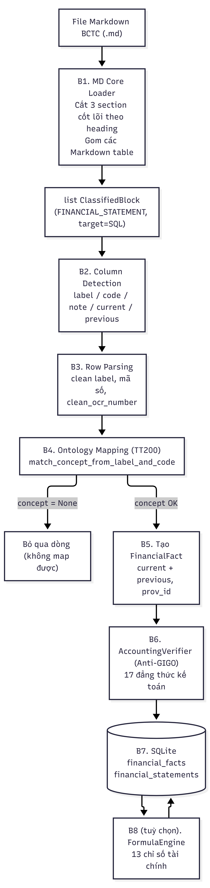
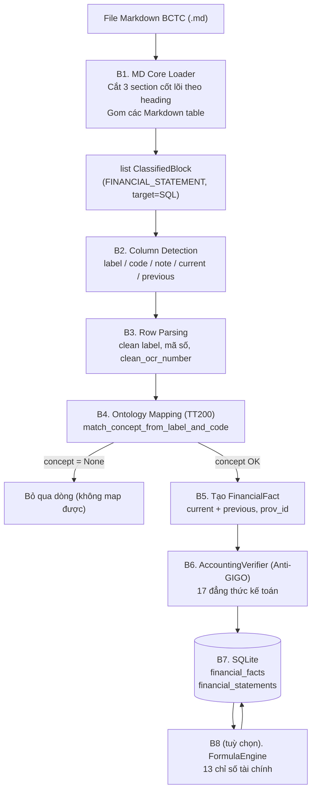
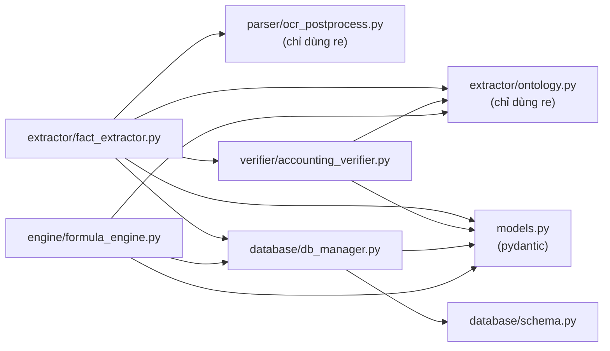
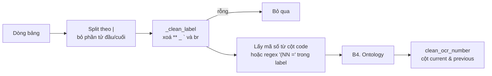
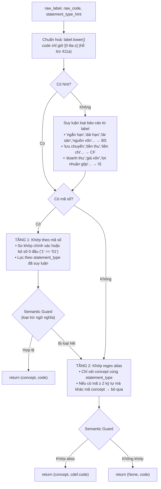
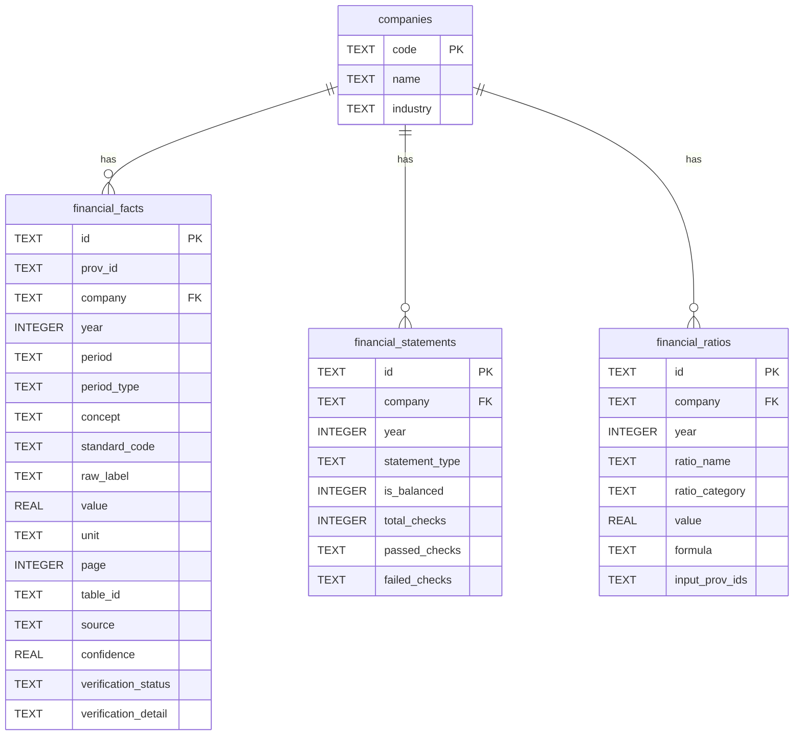

# Workflow: Markdown → Ontology → SQL cho 3 Báo cáo Tài chính Cốt lõi

> **Phạm vi:** Bảng Cân đối kế toán (B01-DN), Báo cáo Kết quả kinh doanh (B02-DN), Báo cáo Lưu chuyển tiền tệ (B03-DN) theo **Thông tư 200/2014/TT-BTC**  
> **Đầu vào:** File Markdown BCTC (output của pipeline OCR/parse, ví dụ [`outputs/HPG_2025_financial_report_final.md`](../outputs/HPG_2025_financial_report_final.md))  
> **Đầu ra:** SQLite gồm các bảng `financial_facts`, `financial_statements`, `financial_ratios`  
> **Mục đích tài liệu:** Mô tả chi tiết luồng xử lý để **tái sử dụng** cụm Ontology + MD-to-SQL trong dự án khác (ví dụ OpenBCTC Copilot).

---

## 1. Tổng quan workflow

<p align="center">
  
</p>



| Bước | Thành phần | File nguồn | Trạng thái |
| :--- | :--- | :--- | :--- |
| B1 | MD Core Loader | *(chưa có — cần viết adapter, mẫu ở mục 4.1)* | 🆕 Mới |
| B2 | `_detect_columns` | [fact_extractor.py#L199-L296](../src/extractor/fact_extractor.py#L199-L296) | ✅ Có sẵn |
| B3 | `_extract_from_table_block` + `clean_ocr_number` | [fact_extractor.py#L81-L191](../src/extractor/fact_extractor.py#L81-L191), [ocr_postprocess.py#L129-L217](../src/parser/ocr_postprocess.py#L129-L217) | ✅ Có sẵn |
| B4 | `match_concept_from_label_and_code` | [ontology.py#L1751-L1912](../src/extractor/ontology.py#L1751-L1912) | ✅ Có sẵn |
| B5 | `FinancialFact` | [models.py#L270-L294](../src/models.py#L270-L294) | ✅ Có sẵn |
| B6 | `AccountingVerifier.verify_facts` | [accounting_verifier.py](../src/verifier/accounting_verifier.py) | ✅ Có sẵn |
| B7 | `DatabaseManager` + `SCHEMA_SQL` | [db_manager.py](../src/database/db_manager.py), [schema.py](../src/database/schema.py) | ✅ Có sẵn |
| B8 | `FormulaEngine` | [formula_engine.py](../src/engine/formula_engine.py) | ✅ Có sẵn (tuỳ chọn) |

---

## 2. Danh sách file cần mang sang (Dependency Closure)

Cụm này **rất ít phụ thuộc**: chỉ cần `pydantic>=2` + thư viện chuẩn (`re`, `sqlite3`, `json`, `logging`). Không cần LangGraph, pdfplumber, OCR hay LLM.



| # | File | Kích thước | Ghi chú khi port |
| :-: | :--- | :--- | :--- |
| 1 | `src/extractor/ontology.py` | ~1.900 dòng | Copy nguyên. Đây là "tài sản" chính: **178 concept** (114 CĐKT, 20 KQKD, 44 LCTT) |
| 2 | `src/parser/ocr_postprocess.py` | ~380 dòng | Chỉ cần hàm `clean_ocr_number` (có thể tách riêng thành `numbers.py`) |
| 3 | `src/models.py` | ~325 dòng | Chỉ cần `ParsedBlock`, `ClassifiedBlock`, `BlockType`, `StorageTarget`, `FinancialFact`, `FinancialRatio`, `VerificationReport`, `VerificationStatus` |
| 4 | `src/verifier/accounting_verifier.py` | ~700 dòng | Copy nguyên |
| 5 | `src/extractor/fact_extractor.py` | ~320 dòng | Copy nguyên, đổi import `clean_ocr_number` nếu tách file |
| 6 | `src/database/schema.py` | ~70 dòng | Copy nguyên (khuyến nghị bổ sung cột ở mục 8) |
| 7 | `src/database/db_manager.py` | ~320 dòng | Copy nguyên |
| 8 | `src/engine/formula_engine.py` | ~350 dòng | Tuỳ chọn, nếu cần 13 chỉ số |

> [!TIP]
> `ParsedDocument.to_markdown()` trong `models.py` import `filter_noise_and_images`, `strip_boilerplate_lines` từ `ocr_postprocess` — nếu chỉ copy `clean_ocr_number` thì xoá luôn `ParsedDocument`/`Section` khỏi `models.py` (không cần cho luồng MD → SQL).

---

## 3. Hợp đồng dữ liệu đầu vào (Input Contract)

Để luồng chạy ổn định, file Markdown cần thỏa mãn:

| Yêu cầu | Ví dụ hợp lệ | Ghi chú |
| :--- | :--- | :--- |
| Mỗi báo cáo có **1 heading** chứa từ khoá nhận diện | `### BẢNG CÂN ĐỐI KẾ TOÁN`, `### BÁO CÁO KẾT QUẢ HOẠT ĐỘNG KINH DOANH`, `### BÁO CÁO LƯU CHUYỂN TIỀN TỆ` | Heading cấp bất kỳ (`#`…`######`) |
| Bảng là **GFM table**, mỗi dòng bắt đầu và kết thúc bằng `\|` | `\| TÀI SẢN \| Mã số \| Thuyết minh \| Số cuối năm \| Số đầu năm \|` | Cần ≥ 3 dòng (header + separator + ≥1 data) |
| Dòng thứ 2 là separator | `\| --- \| --- \| --- \|` | Bị bỏ qua khi parse |
| Có cột **Mã số** (khuyến nghị mạnh) | `100`, `110`, `01`, `1`, `411a` | Mã số là tín hiệu map mạnh nhất |
| Số theo định dạng VN hoặc EN | `1.383.355.031.957`, `1,383,355,031,957`, `(15.200.000)`, `-14,347,359` | Ngoặc đơn = số âm; `-` đứng một mình = 0 |
| (Tuỳ chọn) dòng trang | `*(Trang 7–9)*` ngay dưới heading | Dùng để gán `page` cho fact |

Ví dụ thực tế (trích từ HPG 2025):

```markdown
### BẢNG CÂN ĐỐI KẾ TOÁN
*(Trang 7–9)*

Đơn vị: VND

| TÀI SẢN | Mã số | Thuyết minh | Số cuối năm | Số đầu năm |
| --- | --- | --- | --- | --- |
| **A. TÀI SẢN NGẮN HẠN** | 100 |  | 1,383,355,031,957 | 1,015,072,291,199 |
| **I. Tiền và các khoản tương đương tiền** | 110 | 5 | 481,464,857,088 | 319,257,876,941 |
```

---

## 4. Chi tiết từng bước

### 4.1. B1 — MD Core Loader (cần viết mới)

Pipeline hiện tại nhận `ClassifiedBlock` trực tiếp từ OCR, **chưa có** bước đọc file `.md`. Adapter dưới đây (đã chạy thử thành công, xem mục 5) làm nhiệm vụ:

1. Quét từng dòng, khi gặp heading → kiểm tra có phải 1 trong 3 báo cáo không.
2. Đang ở trong section báo cáo → gom các dòng bảng liên tiếp thành 1 block.
3. Gặp heading **cùng cấp hoặc cao hơn** không phải báo cáo → thoát section.
4. Đóng gói mỗi bảng thành `ClassifiedBlock(block_type=FINANCIAL_STATEMENT, target=[SQL])`.

```python
"""md_core_loader.py — Đọc file Markdown BCTC, trích các bảng của 3 báo cáo cốt lõi."""

import re
from pathlib import Path

from src.models import BlockType, ClassifiedBlock, ParsedBlock, StorageTarget

STATEMENT_HEADINGS: dict[str, list[str]] = {
    "BALANCE_SHEET": [r"cân đối kế toán", r"tình hình tài chính"],
    "INCOME_STATEMENT": [r"kết quả hoạt động kinh doanh", r"kết quả kinh doanh"],
    "CASH_FLOW": [r"lưu chuyển tiền tệ"],
}
HEADING_RE = re.compile(r"^(#{1,6})\s+(.*)$")
PAGE_RE = re.compile(r"\*\(Trang\s+(\d+)")


def detect_statement(title: str) -> str | None:
    t = title.lower()
    for statement, patterns in STATEMENT_HEADINGS.items():
        if any(re.search(p, t) for p in patterns):
            return statement
    return None


def load_core_blocks(md_path: Path) -> list[tuple[str, ClassifiedBlock]]:
    """Trả về danh sách (statement_type, ClassifiedBlock) cho từng bảng thuộc 3 BCTC cốt lõi."""
    out: list[tuple[str, ClassifiedBlock]] = []
    current_st: str | None = None
    current_level, page, tbl_idx = 0, 1, 0
    buf: list[str] = []

    def flush() -> None:
        nonlocal buf, tbl_idx
        if current_st and len(buf) >= 3:
            tbl_idx += 1
            block = ParsedBlock(
                block_id=f"{current_st.lower()}_t{tbl_idx}",
                block_type="table",
                page=page,
                content="\n".join(buf),
                source="pdfplumber",
            )
            out.append((current_st, ClassifiedBlock(
                block=block,
                block_type=BlockType.FINANCIAL_STATEMENT,
                target=[StorageTarget.SQL],
                confidence=1.0,
                classification_method="rule_based",
            )))
        buf = []

    for line in md_path.read_text(encoding="utf-8").splitlines():
        if m := HEADING_RE.match(line):
            flush()
            level, title = len(m.group(1)), m.group(2)
            if st := detect_statement(title):
                current_st, current_level = st, level
            elif current_st and level <= current_level:
                current_st = None  # Rời khỏi section báo cáo
            continue

        stripped = line.strip()
        if current_st and (pm := PAGE_RE.match(stripped)):
            page = int(pm.group(1))
        if stripped.startswith("|") and stripped.endswith("|"):
            buf.append(stripped)
        else:
            flush()  # Dòng không phải bảng -> kết thúc bảng hiện tại

    flush()
    return out
```

> [!NOTE]
> Một báo cáo có thể sinh **nhiều bảng** (ví dụ CĐKT tách phần TÀI SẢN / NGUỒN VỐN, hoặc bảng bị ngắt trang). Điều này không ảnh hưởng: mỗi bảng được parse độc lập và fact được gộp chung ở bước B6.

---

### 4.2. B2 — Nhận diện cột (`_detect_columns`)

Phân tích **dòng header** để xác định vị trí 5 vai trò cột. Thứ tự ưu tiên:

| Thứ tự | Vai trò | Từ khoá nhận diện (lowercase, `in`) |
| :-: | :--- | :--- |
| 1 | `label` | `chỉ tiêu`, `chi tieu`, `tài sản`, `nguồn vốn`, `khoản mục`, `nội dung` → fallback cột 0 |
| 2 | `code` | `mã số`, `ma so`, `mã`, `code` |
| 3 | `note` | `thuyết minh`, `thuyet minh`, `tm`, `note` |
| 4 | Fallback bảng thiếu header (khi **không** tìm thấy `code`) | 5 cột: `[label, code, note, current, previous]` · 4 cột: `[label, code, current, previous]` · 3 cột: `[label, current, previous]` |
| 5 | `current` / `previous` | Các cột còn lại theo thứ tự. Nếu cột số đầu tiên chứa `đầu năm`, `năm trước` hoặc `01/01` → đảo: cột đầu là `previous` |

Nếu không xác định được `label` hoặc `current` → **bỏ qua cả bảng**.

Ví dụ:

| Header | label | code | note | current | previous |
| :--- | :-: | :-: | :-: | :-: | :-: |
| `TÀI SẢN \| Mã số \| Thuyết minh \| Số cuối năm \| Số đầu năm` | 0 | 1 | 2 | 3 | 4 |
| `CHỈ TIÊU \| Mã số \| Năm nay \| Năm trước` | 0 | 1 | – | 2 | 3 |
| `Chỉ tiêu \| Số đầu năm \| Số cuối năm` | 0 | – | – | 2 | 1 |

---

### 4.3. B3 — Parse từng dòng dữ liệu

Với mỗi dòng (sau khi bỏ separator `| --- |`):



**Quy tắc `clean_ocr_number`** ([ocr_postprocess.py#L129-L217](../src/parser/ocr_postprocess.py#L129-L217)):

| Đầu vào | Kết quả | Quy tắc |
| :--- | :--- | :--- |
| `1.383.355.031.957` | `1383355031957.0` | Nhiều dấu `.` → phân cách nghìn |
| `1,383,355,031,957` | `1383355031957.0` | Nhiều dấu `,` → phân cách nghìn |
| `1.234.567,89` | `1234567.89` | Dấu `,` đứng sau cùng → kiểu VN |
| `(15.200.000)` | `-15200000.0` | Ngoặc đơn (kể cả full-width `（）`) → số âm |
| `-14,347,359` | `-14347359.0` | Dấu trừ đầu |
| `-`, `—`, `–` | `0.0` | Gạch ngang đứng một mình = 0 |
| `1O2.3l5` | `102315.0` | Sửa lỗi OCR: `O/o→0`, `l/I/\|→1` |
| `Thuyết minh 5` | `None` | Chứa chữ cái thường → không phải số |
| `1.234` | `1234.0` | 1 dấu, đúng 3 chữ số sau → phân cách nghìn |
| `0.75` | `0.75` | Bắt đầu bằng `0.` → thập phân |

Dòng chỉ có tiêu đề nhóm (ví dụ `I. LƯU CHUYỂN TIỀN TỪ HOẠT ĐỘNG KINH DOANH` với các ô số trống) → `clean_ocr_number("")` trả `None` → không sinh fact.

---

### 4.4. B4 — Ontology Mapping (trái tim của hệ thống)

#### 4.4.1. Cấu trúc Ontology

```python
class ConceptDefinition(NamedTuple):
    concept: str          # Canonical ID: "TOTAL_ASSETS", "NET_REVENUE", "CF_NET_OPERATING"
    code: str             # Mã số TT200: "270", "10", "20"
    standard_name: str    # Tên chuẩn: "TỔNG CỘNG TÀI SẢN"
    aliases: list[str]    # Regex tên khoản mục (có dấu + không dấu + có tiền tố La Mã)
    statement_type: str   # "BALANCE_SHEET" | "INCOME_STATEMENT" | "CASH_FLOW"
```

| Báo cáo | Số concept | Ví dụ concept → mã |
| :--- | :-: | :--- |
| `BALANCE_SHEET` | 114 | `CURRENT_ASSETS`→100, `CASH_AND_EQUIVALENTS`→110, `TOTAL_ASSETS`→270, `LIABILITIES`→300, `EQUITY`→400, `TOTAL_RESOURCES`→440 |
| `INCOME_STATEMENT` | 20 | `GROSS_REVENUE`→01, `NET_REVENUE`→10, `COGS`→11, `GROSS_PROFIT`→20, `PROFIT_BEFORE_TAX`→50, `NET_PROFIT`→60 |
| `CASH_FLOW` | 44 | Trực tiếp `CF_DIRECT_*`→01..07, Gián tiếp `CF_PROFIT_BEFORE_TAX`→01, `CF_NET_OPERATING`→20, `CF_NET_INVESTING`→30, `CF_NET_FINANCING`→40, `CF_ENDING_CASH`→70 |

Ba từ điển tra cứu nhanh ([ontology.py#L1740-L1748](../src/extractor/ontology.py#L1740-L1748)):

- `CONCEPT_TO_DEF[concept]` → `ConceptDefinition`
- `CONCEPT_TO_CODE[concept]` → mã số chuẩn (dùng trong Verifier & FormulaEngine để chấm điểm ưu tiên)
- `CODE_TO_CONCEPT[code]` → concept (ưu tiên CĐKT/KQKD khi trùng mã với LCTT)

#### 4.4.2. Thuật toán `match_concept_from_label_and_code`



**Semantic Guards** — chặn khoản mục con "chiếm chỗ" khoản mục cha, và chặn nhầm giữa các báo cáo dùng chung mã số:

| Concept | Bị loại nếu label chứa | Lý do |
| :--- | :--- | :--- |
| `SHORT_TERM_RECEIVABLES` (130) | `khác`, `khách hàng`, `dự phòng` | Đó là các dòng con 131, 136, 137 |
| `INVENTORIES` (140) | `dự phòng`, `giảm giá` | Dòng 149 – Dự phòng giảm giá HTK |
| `FIXED_ASSETS` (220) | `hữu hình`, `vô hình` | Dòng 221, 227 |
| `LIABILITIES` (300) | `ngắn hạn`, `dài hạn` | Dòng 310, 330 |
| `EQUITY` / `OWNERS_EQUITY_TOTAL` | `góp`, `cổ phần`, `chưa phân phối`, `thặng dư`, `quỹ` | Các dòng con của vốn CSH |
| `INCOME_STATEMENT` (mọi concept) | `lưu chuyển`, `tiền thuần`, `biến động`, `tiền thu`, `tiền chi` | Mã 01/10/20… trùng với LCTT |
| `CF_DIRECT_SALES_PROCEEDS` (01) vs `CF_PROFIT_BEFORE_TAX` (01) | `lợi nhuận`/`trước thuế` vs `bán hàng`/`cung cấp dịch vụ` | Phân biệt LCTT **trực tiếp** vs **gián tiếp** cùng mã 01–07 |

Ví dụ thực tế:

| raw_label | raw_code | hint | Kết quả |
| :--- | :-: | :--- | :--- |
| `A. TÀI SẢN NGẮN HẠN` | `100` | BS | `CURRENT_ASSETS`, `100` |
| `4. Phải thu ngắn hạn khác` | `136` | BS | `SHORT_TERM_OTHER_RECEIVABLES`, `136` (không bị gộp nhầm vào 130 nhờ guard `khác`) |
| `Lưu chuyển tiền thuần từ hoạt động kinh doanh` | `20` | *(không có)* | `CF_NET_OPERATING`, `20` (tự suy luận CF từ `lưu chuyển`) |
| `1. Lợi nhuận trước thuế` | `1` | CF | `CF_PROFIT_BEFORE_TAX`, `1` |
| `Doanh thu thuần về bán hàng và cung cấp dịch vụ` | `10` | IS | `NET_REVENUE`, `10` |
| `Lưu chuyển tiền thuần từ hoạt động kinh doanh` | `20` | CF | `CF_NET_OPERATING`, `20` (không bị nhầm `GROSS_PROFIT` mã 20) |

> [!IMPORTANT]
> Mã số **trùng nhau giữa KQKD và LCTT** (01, 02, 10, 11, 20, 21, 22, 25, 26, 30, 31, 32, 40, 50, 51, 52, 60…). Vì vậy `statement_type_hint` là tham số quyết định. Trong `FinancialFactExtractor`, hint được lấy từ `_detect_statement_type` dựa trên **nội dung bảng** ([fact_extractor.py#L298-L316](../src/extractor/fact_extractor.py#L298-L316)) — xem lưu ý ở mục 7.

---

### 4.5. B5 — Tạo `FinancialFact`

Mỗi dòng map được concept sinh **tối đa 2 fact** (kỳ này và kỳ trước):

| Trường | Kỳ này (`current`) | Kỳ trước (`previous`) |
| :--- | :--- | :--- |
| `id` | `{company}_{year}_current_{concept}` | `{company}_{year}_previous_{concept}` |
| `prov_id` | `{company}_{year}_p{page}_{table_id}_r{row_idx}` | `…_prev` |
| `period` | `"{year}"` | `"{year-1}"` |
| `period_type` | `current` | `previous` |
| `year` | `year` (năm của báo cáo) | `year` (**vẫn là năm báo cáo**) |
| `standard_code` | mã từ ontology, fallback mã thô | như bên trái |
| `unit` | `"VND"` (hard-code) | `"VND"` |
| `verification_status` | `UNCHECKED` (cập nhật ở B6) | `UNCHECKED` |

**Chống trùng ID:** nếu cùng `company_year_period_type_concept` xuất hiện nhiều lần (ví dụ bảng bị lặp header, hoặc 2 dòng cùng map 1 concept), fact thứ 2 trở đi có hậu tố `_2`, `_3`… ([fact_extractor.py#L58-L67](../src/extractor/fact_extractor.py#L58-L67)).

---

### 4.6. B6 — Kiểm toán số học Anti-GIGO

`AccountingVerifier.verify_facts(facts, company, year)`:

1. **Chọn fact đại diện** cho mỗi concept (kỳ hiện tại) bằng điểm ưu tiên:
   - `+50` nếu `standard_code` khớp `CONCEPT_TO_CODE`, `-30` nếu lệch mã.
   - `-100` nếu concept KQKD nhưng label mang nghĩa LCTT.
   - `-40` nếu concept cha nhưng label chứa `khác`, `dự phòng`, `nguyên giá`, `hao mòn`.
2. **Chạy 17 đẳng thức** với dung sai: `|a - b| ≤ 2.0` **hoặc** `|a - b| / max(|a|,|b|) ≤ 0.01%`.
3. **Ghi trạng thái** lên từng fact: `VERIFIED` / `DISCREPANCY` (+ `verification_detail`).

| # | Báo cáo | Đẳng thức (mã TT200) |
| :-: | :--- | :--- |
| 1 | CĐKT | 270 = 440 (Tổng tài sản = Tổng nguồn vốn) |
| 2 | CĐKT | 270 = 100 + 200 |
| 3 | CĐKT | 100 = 110 + 120 + 130 + 140 + 150 |
| 4 | CĐKT | 200 = 210 + 220 + 230 + 240 + 250 + 260 |
| 5 | CĐKT | 440 = 300 + 400 |
| 6 | CĐKT | 300 = 310 + 330 |
| 7 | KQKD | 10 = 01 − 02 |
| 8 | KQKD | 20 = 10 − 11 |
| 9 | KQKD | 30 = 20 + 21 − 22 − 25 − 26 |
| 10 | KQKD | 40 = 31 − 32 |
| 11 | KQKD | 50 = 30 + 40 |
| 12 | KQKD | 60 = 50 − 51 − 52 |
| 13 | LCTT | 40 = 31 − 32 + 33 − 34 − 35 − 36 |
| 14 | LCTT | 50 = 20 + 30 + 40 |
| 15 | LCTT | 70 = 60 + 50 + 61 |
| 16 | **Chéo** | LCTT 70 = CĐKT 110 (Tiền cuối kỳ) |
| 17 | **Chéo** | LCTT gián tiếp 01 = KQKD 50 (LN trước thuế) |

Kết quả trả về `VerificationReport(is_balanced, total_checks, passed_checks, failed_checks, discrepancies)`.

> [!NOTE]
> Một đẳng thức chỉ chạy khi **đủ các concept tham gia**. Thiếu concept → không tính vào `total_checks` (không fail). Vì vậy cần theo dõi thêm `total_checks` chứ không chỉ `is_balanced`.

---

### 4.7. B7 — Ghi SQLite

Trình tự trong `extract_from_blocks` ([fact_extractor.py#L72-L77](../src/extractor/fact_extractor.py#L72-L77)):

```text
save_company(company)                 -> INSERT ... ON CONFLICT DO UPDATE
clear_facts(company, year)            -> DELETE toàn bộ facts của (company, year)
save_facts(facts)                     -> UPSERT theo id
save_verification_report(report)      -> UPSERT financial_statements id = {COMPANY}_{YEAR}_CONSOLIDATED
```



Index có sẵn: `(company, year)`, `concept`, `prov_id` trên `financial_facts`; `(company, year)`, `ratio_name` trên `financial_ratios`.

---

### 4.8. B8 (tuỳ chọn) — FormulaEngine

`FormulaEngine(db_manager).compute_all_ratios(facts, company, year)` → 13 `FinancialRatio` (deterministic, lưu `input_prov_ids` để truy vết):

| Nhóm | Chỉ số | Công thức |
| :--- | :--- | :--- |
| Thanh khoản | `current_ratio`, `quick_ratio`, `cash_ratio` | `CURRENT_ASSETS / CURRENT_LIABILITIES`, `(CURRENT_ASSETS − INVENTORIES) / CURRENT_LIABILITIES`, `CASH_AND_EQUIVALENTS / CURRENT_LIABILITIES` |
| Đòn bẩy | `debt_to_equity`, `debt_to_assets`, `financial_leverage` | `LIABILITIES / EQUITY`, `LIABILITIES / TOTAL_ASSETS`, `TOTAL_ASSETS / EQUITY` |
| Sinh lời | `gross_margin`, `net_profit_margin`, `operating_margin`, `roa`, `roe` | `GROSS_PROFIT / NET_REVENUE`, `NET_PROFIT / NET_REVENUE`, `OPERATING_PROFIT / NET_REVENUE`, `NET_PROFIT / TOTAL_ASSETS`, `NET_PROFIT / EQUITY` |
| Hiệu quả & rủi ro | `asset_turnover`, `altman_z_score` | `NET_REVENUE / TOTAL_ASSETS`, `0.717·X1 + 0.847·X2 + 3.107·X3 + 0.420·X4 + 0.998·X5` |

---

## 5. Kết quả kiểm chứng thực tế

Đã chạy adapter ở mục 4.1 + `FinancialFactExtractor` (không sửa code gốc) trên file của repo:

```powershell
python md_to_sql_proto.py outputs\HPG_2025_financial_report_final.md HPG 2025
```

| Chỉ tiêu | Kết quả |
| :--- | :--- |
| Số bảng nhận diện | 7 (CĐKT: 4, KQKD: 1, LCTT: 2) |
| Số fact sinh ra | **209** (105 `current` + 104 `previous`) |
| Kiểm toán Anti-GIGO | **17/17 PASS** — `is_balanced = True` |
| Fact `VERIFIED` | 33 |
| Fact `DISCREPANCY` | 0 |
| Thời gian | < 1 giây, 0 API call |

Kết quả giống nhau với cả `HPG_2025_financial_report.md` và bản `_final.md`.

---

## 6. Mẫu truy vấn SQL (phục vụ Text-to-SQL / Copilot)

```sql
-- 1. Các chỉ tiêu chính kỳ này của một doanh nghiệp
SELECT concept, standard_code, raw_label, value, verification_status
FROM financial_facts
WHERE company = 'HPG' AND year = 2025 AND period_type = 'current'
  AND concept IN ('TOTAL_ASSETS', 'NET_REVENUE', 'NET_PROFIT', 'CF_NET_OPERATING');

-- 2. So sánh kỳ này vs kỳ trước (cùng 1 báo cáo năm)
SELECT c.concept, c.value AS nam_nay, p.value AS nam_truoc,
       ROUND((c.value - p.value) * 100.0 / NULLIF(ABS(p.value), 0), 2) AS tang_truong_pct
FROM financial_facts c
JOIN financial_facts p
  ON p.company = c.company AND p.year = c.year AND p.concept = c.concept
 AND p.period_type = 'previous'
 AND p.id = c.company || '_' || c.year || '_previous_' || c.concept
WHERE c.company = 'HPG' AND c.year = 2025 AND c.period_type = 'current'
  AND c.id = c.company || '_' || c.year || '_current_' || c.concept;

-- 3. Tình trạng kiểm toán của báo cáo
SELECT company, year, is_balanced, total_checks, failed_checks
FROM financial_statements WHERE company = 'HPG' AND year = 2025;

-- 4. Truy vết nguồn gốc 1 chỉ số
SELECT ratio_name, value, formula, input_prov_ids
FROM financial_ratios WHERE company = 'HPG' AND year = 2025 AND ratio_name = 'roe';
```

> [!TIP]
> Điều kiện `id = company || '_' || year || '_current_' || concept` lọc bỏ các bản ghi trùng có hậu tố `_2`, `_3`. Nên đóng gói thành một **VIEW** (xem mục 8) để LLM không phải nhớ quy tắc này.

---

## 7. Lưu ý & cạm bẫy khi tái sử dụng

| # | Vấn đề | Ảnh hưởng | Cách xử lý |
| :-: | :--- | :--- | :--- |
| 1 | **`unit` hard-code `"VND"`** | BCTC đơn vị *triệu đồng* sẽ lưu sai 10⁶ lần | Loader đọc dòng `Đơn vị: ...` trong section → nhân hệ số trước khi lưu, hoặc truyền `unit` vào fact |
| 2 | **Loại báo cáo suy từ nội dung bảng**, không từ heading | Bảng nối trang (không còn từ khoá) có thể bị gán `UNKNOWN` → map dựa vào suy luận theo label, dễ nhầm IS ↔ CF do trùng mã | Thêm tham số `statement_type_hint` cho `extract_from_blocks` (hoặc ghi vào `block.metadata`) và dùng hint từ heading mà loader đã nhận diện |
| 3 | **Fact kỳ trước có `year` = năm báo cáo** | Truy vấn `year = 2024` sẽ **không** lấy được số 2024 nằm trong BCTC 2025 | Truy vấn theo `period = '2024'`, hoặc ưu tiên `period_type='current'` của báo cáo năm 2024 nếu có |
| 4 | **`clear_facts(company, year)` xoá toàn bộ** | Nạp riêng từng báo cáo (CĐKT trước, KQKD sau) sẽ xoá dữ liệu của lần nạp trước | Luôn nạp **cả 3 báo cáo trong một lần gọi** `extract_from_blocks` |
| 5 | **Hợp nhất vs Riêng** | `save_verification_report` mặc định `statement_type='CONSOLIDATED'`; facts không có cột phân biệt | Thêm cột `report_scope` (`CONSOLIDATED`/`SEPARATE`) vào khoá `id` và bảng `financial_facts` |
| 6 | **Dòng không map được bị bỏ im lặng** | Không biết độ phủ ontology | Log số dòng bị bỏ qua / tổng số dòng; lưu bảng `unmapped_rows` để bổ sung alias |
| 7 | **Trùng concept (`_2`, `_3`)** | Verifier chọn đúng bản ghi nhờ điểm ưu tiên, nhưng SQL vẫn còn bản ghi phụ | Dùng VIEW lọc bản ghi chính hoặc thêm cột `is_primary` |
| 8 | **`page` chỉ là trang bắt đầu của section** | MD mất thông tin trang theo từng dòng | Chấp nhận cho MD; nếu cần chính xác, giữ `page` từ pipeline OCR gốc |
| 9 | **Extractor có side-effect** (tự tạo Verifier, tự ghi DB) | Khó test, khó tái sử dụng | Truyền `db_manager=None` để chỉ lấy facts, tự gọi `DatabaseManager` bên ngoài (đúng tinh thần *Thin Node, Fat Service* trong [agent_lean_architecture_guide.md](agent_lean_architecture_guide.md)) |
| 10 | **`source` là `Literal["pdfplumber","ocr"]`** | Không ghi được nguồn `"markdown"` | Mở rộng Literal nếu muốn truy vết nguồn MD |

---

## 8. Đề xuất khi port sang dự án mới (OpenBCTC Copilot)

### 8.1. Cấu trúc module

```text
fin_facts/                         # Package độc lập, chỉ phụ thuộc pydantic
├── __init__.py                    # export: ingest_markdown()
├── ontology.py                    # Copy nguyên từ src/extractor/ontology.py
├── numbers.py                     # clean_ocr_number (tách từ ocr_postprocess.py)
├── models.py                      # Rút gọn: ParsedBlock, ClassifiedBlock, FinancialFact, ...
├── md_loader.py                   # B1 — adapter ở mục 4.1 (+ đọc "Đơn vị")
├── fact_extractor.py              # B2–B5
├── verifier.py                    # B6 — accounting_verifier.py
├── formula_engine.py              # B8 (tuỳ chọn)
├── db/
│   ├── schema.py                  # B7 + VIEW bổ sung
│   └── manager.py
└── cli.py                         # python -m fin_facts.cli --md ... --company ... --year ...
```

### 8.2. Hàm điều phối duy nhất

```python
def ingest_markdown(md_path: str, company: str, year: int, db_path: str = "data/finaudit.db") -> VerificationReport:
    """MD -> Ontology -> Facts -> Verify -> SQLite. Idempotent theo (company, year)."""
    blocks = [cb for _, cb in load_core_blocks(Path(md_path))]
    db = DatabaseManager(db_path)
    facts, report = FinancialFactExtractor(db_manager=db).extract_from_blocks(blocks, company=company, year=year)
    ratios = FormulaEngine(db_manager=db).compute_all_ratios(facts, company=company, year=year)
    db.save_ratios(ratios)
    return report
```

### 8.3. Bổ sung schema khuyến nghị

```sql
-- Loại báo cáo cho từng fact (suy ra từ CONCEPT_TO_DEF[concept].statement_type)
ALTER TABLE financial_facts ADD COLUMN statement_type TEXT;   -- BALANCE_SHEET | INCOME_STATEMENT | CASH_FLOW
ALTER TABLE financial_facts ADD COLUMN report_scope TEXT DEFAULT 'CONSOLIDATED';

-- VIEW "sạch" cho Text-to-SQL: 1 dòng / (company, year, period_type, concept)
CREATE VIEW IF NOT EXISTS v_core_facts AS
SELECT company, year, period, period_type, statement_type, concept,
       standard_code, raw_label, value, unit, verification_status, prov_id
FROM financial_facts
WHERE id = company || '_' || year || '_' || period_type || '_' || concept;
```

> [!TIP]
> Khi tích hợp với LlamaIndex `NLSQLTableQueryEngine`, chỉ expose `v_core_facts`, `financial_ratios`, `financial_statements` kèm mô tả bảng và danh sách concept (lấy từ `ONTOLOGY_DEFINITIONS`: `concept`, `code`, `standard_name`) để LLM sinh SQL đúng tên concept.

---

## 9. Checklist kiểm thử khi port

- [ ] `match_concept_from_label_and_code` — test mã trùng IS/CF (01, 10, 20, 50) với từng hint.
- [ ] `clean_ocr_number` — test các định dạng ở bảng mục 4.3.
- [ ] `_detect_columns` — test header 3/4/5 cột, header đảo thứ tự (`Số đầu năm` trước `Số cuối năm`).
- [ ] `load_core_blocks` — test MD có bảng nối trang, có heading con bên trong section, có section Thuyết minh phía sau (không được lọt vào).
- [ ] End-to-end trên ≥ 2 BCTC thật (ví dụ VNM 2024, HPG 2025): `is_balanced = True`, `total_checks ≥ 15`.
- [ ] Nạp lại cùng `(company, year)` 2 lần → số fact không đổi (idempotent).
- [ ] Có thể tái sử dụng test hiện có: [`tests/test_extractor.py`](../tests/test_extractor.py), [`tests/test_verifier.py`](../tests/test_verifier.py), [`tests/test_database.py`](../tests/test_database.py), [`tests/test_formula_engine.py`](../tests/test_formula_engine.py).
